How **StackGen-facing modules** in this repository stack together—**foundation and policies** at the base, **integrations** and **agents** above, and **workflow** compositions on top. Many paths are **AIOS-oriented** (prefixed `aios-*`) for faster solution delivery; the same layering idea applies if you mix in your own roots. For formatting, validation, and CI for **this repository** (Makefile, GitHub Actions, registry token), see the root [README](https://github.com/appcd-dev/solutions/blob/main/README.md) — **Local verification** and **Continuous integration**. (If you use a fork or different repo name, adjust that link or open `README.md` at the repository root.)

## Layered dependency graph

```mermaid
graph TD
    subgraph "Layer 3 — Solutions"
        WF_IR["aios-workflow-incident-response"]
        WF_PS["aios-workflow-predictive-sre"]
        WF_FD["aios-workflow-feature-development"]
    end

    subgraph "Layer 2 — Agents"
        A_SRE["aios-agent-sre<br/>(5 agents, 2 workflows)"]
        A_AWS["aios-agent-aws-sre"]
        A_GCP["aios-agent-gcp-sre"]
        A_AZ["aios-agent-azure-devops"]
        A_GR["aios-agent-grafana-sre"]
        A_SE["aios-agent-software-engineering"]
        A_SC["aios-agent-supply-chain-security"]
        A_WA["aios-agent-workspace-assistant"]
        A_MK["aios-agent-marketing"]
        A_CO["aios-agent-compliance-auditor"]
        A_FO["aios-agent-cost-optimizer"]
        A_OB["aios-agent-onboarding"]
        A_PS["aios-agent-predictive-sre"]
    end

    subgraph "Layer 1 — Integrations"
        I_AWS["aios-integration-aws"]
        I_AZ["aios-integration-azure"]
        I_GR["aios-integration-grafana"]
        I_SL["aios-integration-slack"]
        I_GH["aios-integration-github"]
        I_CH["aios-integration-clickhouse"]
    end

    subgraph "Layer 0 — Foundation"
        F["aios-foundation<br/>(models, secrets)"]
        P["aios-policies<br/>(12 guardrail policies)"]
    end

    %% Layer 3 → Layer 2
    WF_IR --> A_SRE
    WF_PS --> A_PS
    WF_FD --> A_SE

    %% Layer 2 → Layer 1
    A_AWS --> I_AWS
    A_GCP -.- I_AWS
    A_AZ --> I_AZ
    A_GR --> I_GR
    A_SE --> I_GH
    A_CO --> I_AWS
    A_CO --> I_GH
    A_FO --> I_AWS
    A_PS --> I_GH
    A_PS --> I_GR
    A_PS --> I_AWS

    %% Layer 2 → Layer 0
    A_SRE --> F
    A_SRE --> P
    A_AWS --> F
    A_AWS --> P
    A_GCP --> F
    A_GCP --> P

    %% Layer 1 → Layer 0
    I_AWS --> F
    I_AZ --> F
    I_GR --> F
    I_SL --> F
    I_GH --> F
```

## Resource Inventory by Module

Show inventory table

| Module | Agents | Runbooks | Workflows | Policies | Remediation Patterns |
|--------|--------|----------|-----------|----------|---------------------|
| aios-agent-sre | 5 | 9 | 2 | — | 8 |
| aios-agent-aws-sre | 1 | 4 | 2 | 1 | — |
| aios-agent-gcp-sre | 1 | 4 | 2 | 1 | — |
| aios-agent-azure-devops | 1 | 4 | 1 | — | 2 |
| aios-agent-grafana-sre | 1 | 8 | — | — | — |
| aios-agent-software-engineering | 2 | 3 | 1 | — | — |
| aios-agent-supply-chain-security | 1 | 3 | 1 | 3 | 2 |
| aios-agent-workspace-assistant | 1 | 1 | 1 | — | — |
| aios-agent-marketing | 1 | 5 | 2 | — | — |
| aios-agent-compliance-auditor | 1 | 4 | 1 | 1 | — |
| aios-agent-cost-optimizer | 1 | 4 | 1 | — | — |
| aios-agent-onboarding | 1 | 3 | 1 | — | — |
| aios-agent-predictive-sre | 1 | 2 | 1 | — | — |
| **Total** | **18** | **54** | **16** | **6+12** | **12** |

## Design Principles

1. **Self-contained**: Each module has its own `versions.tf`, personas, policies, and README
2. **Opinionated defaults**: Sensible defaults for budgets, images, policies — zero-config works
3. **Override everything**: All defaults overridable via variables
4. **Composable**: Layer 2 agents take integration names as inputs, not create integrations
5. **Out-of-box policies**: Each agent auto-attaches relevant policies
6. **Multi-cloud SRE**: AWS, Azure, and GCP SRE modules with parallel structures
