# CloudFormation Author (`aios-agent-cfn-author`)

Developer intent → company-standard **CloudFormation** (catalog reuse) → **GitHub PR** → **change-set preview**. Optional **drift management** (parallel detect, risk classify, reconcile PR) and **governance pillar** workflows (FedRAMP/baseline compliance, governed deployment). **Bedrock Claude Sonnet 4.6 only** (`us-east-1`).

**Module source:** [`modules/aios-agent-cfn-author`]({{ site.github.repository_url }}/tree/main/modules/aios-agent-cfn-author)  
**Governance runbooks:** [`modules/aios-cfn-governance-runbooks`]({{ site.github.repository_url }}/tree/main/modules/aios-cfn-governance-runbooks) (nested automatically)  
**Preview IAM (optional):** [`modules/aios-cfn-preview-iam`]({{ site.github.repository_url }}/tree/main/modules/aios-cfn-preview-iam) — change-set preview without mutating stacks  
**Runnable demo:** [`examples/scenarios/cfn-author`]({{ site.github.repository_url }}/tree/main/examples/scenarios/cfn-author) — `make demo SCENARIO=cfn-author`

---

## When to use it

| Customer situation | Use this workflow |
|--------------------|-------------------|
| "Developers describe infra; we need CloudFormation that matches our catalog and opens a PR." | **`intent-to-infrastructure`** |
| "CI must preflight intent against FedRAMP and our org baseline before synthesis." | **`cfn-contextual-compliance`** + compliance webhook |
| "CloudFormation stacks drift — classify risk and reconcile valid changes via PR." | **`cloudformation-drift-management`** (chat, schedule, or drift webhook) |
| "Validated templates must follow our deployment process before we open a PR." | **`cfn-governed-deployment`** (chat) |

**Contrast with [`aios-agent-selfhosted-infra`]({{ site.github.repository_url }}/tree/main/modules/aios-agent-selfhosted-infra):** selfhosted-infra ingests **stack failure events**, investigates read-only, and recommends HITL change sets. CFN Author **authors new templates** from intent and manages **ongoing drift** against your IaC repo.

---

## Four workflows

```mermaid
flowchart TB
  subgraph intent["intent-to-infrastructure (14 stages)"]
    I1[parse-intent] --> I2[compliance-check]
    I2 --> I3[synthesize-template]
    I3 --> I4[quality-check]
    I4 --> I5[open-pr]
    I5 --> I6[preview-changes]
    I6 --> I7[final-intent-summary]
  end

  subgraph drift["cloudformation-drift-management"]
    D1[normalize-drift-ingress] --> D2[parse-drift-scope]
    D2 --> D3[inventory-stacks]
    D3 --> D4[parallel-detect-drift]
    D4 --> D5[classify-drift-recommendation]
    D5 --> D6[open-reconcile-pr]
    D6 --> D7[final-drift-summary]
  end

  subgraph compliance["cfn-contextual-compliance"]
    C1[parse-compliance-intent] --> C2[contextual-compliance-check]
    C2 --> C3[final-compliance-summary]
  end

  subgraph governed["cfn-governed-deployment"]
    G1[parse-governed-context] --> G2[governed-deployment-gate]
    G2 --> G3[open-pr]
    G3 --> G4[final-governed-summary]
  end
```



The intent workflow is **streamlined for cost and latency**: parse + remote orchestration, generate + hardened synthesis, and governed deployment checks are merged into fewer LLM stages; **cfn-lint** and **Checkov/cfn-nag** run in one Ubuntu spawn (scanners in parallel).

| Workflow | Agent | Typical trigger |
|----------|-------|-----------------|
| `intent-to-infrastructure` | `cfn-author` | Guild chat, **intent webhook** (default on) |
| `cloudformation-drift-management` | `cfn-drift-manager` | Guild chat, **drift webhook**, optional **cron** (`enable_drift_schedule`) |
| `cfn-contextual-compliance` | `cfn-author` | Guild chat, **compliance webhook** |
| `cfn-governed-deployment` | `cfn-author` | Guild chat only |

Register skills from output `recommended_skill_names` (sources under `modules/aios-agent-cfn-author/skills/`) before demoing. After module upgrades, **recycle the cfn-author Ubuntu sidecar** when `script_pack_version` changes.

---

## How to trigger each workflow

After `tofu apply`, read webhook URLs from module outputs: `intent_webhook_ingress_payload_url`, `compliance_webhook_ingress_payload_url`, and `drift_webhook_ingress_payload_url` (when enabled).

### 1. Intent to infrastructure — Guild chat

Open Guild chat and invoke workflow **`intent-to-infrastructure`** (or let passive triggers match your message):

```text
Generate an S3 bucket with versioning in us-east-1 and open a PR; preview against stack staging-data
```

Optional notes in chat or webhook JSON:

| Field | Purpose |
|-------|---------|
| `stack_name` | Target stack for change-set preview (read-only) |
| `environment` | staging / production label for tagging and gates |
| `template_file_name` | Filename under `cfn_template_path_prefix` in the PR |
| `github_repo_override` | PR target when different from `target_repository_full_name` |
| `confirm_deploy` | `"true"` → change-set preview after PR; `"false"` → PR only |

**Stages (high level):** parse-intent → compliance-check → synthesize-template → quality-check (lint + guardrails + AWS validate) → open-pr → optional preview → summary.

### 2. Intent to infrastructure — webhook

Webhook name: **`cfn-intent-to-infrastructure`**. POST JSON to StackGen:

```bash
curl -sS -X POST "${INTENT_WEBHOOK_INGRESS_URL}" \
  -H "Content-Type: application/json" \
  -d @docs/samples/cfn-intent-webhook.json
```

Example payload ([`docs/samples/cfn-intent-webhook.json`]({{ site.github.repository_url }}/blob/main/docs/samples/cfn-intent-webhook.json)):

```json
{
  "intent": "Provision a private S3 bucket with versioning enabled, SSE-S3 default encryption, and a bucket policy that denies public ACLs and unencrypted uploads. Target us-east-1 for the staging data plane.",
  "stack_name": "staging-data",
  "environment": "staging",
  "template_file_name": "staging-data-s3-versioning.yaml",
  "workspace_id": "org/infra-templates",
  "correlation_id": "cfn-author-demo-20260607",
  "confirm_deploy": "true"
}
```

Build `INTENT_WEBHOOK_INGRESS_URL` from output **`intent_webhook_ingress_payload_url`** (includes `apiKey` and optional `orgId`), or:

```text
{guild_url}/api/v1/webhooks/trigger?apiKey={intent_webhook_token}&orgId={project_id}
```

#### Using [AWS CloudFormation sample templates](https://github.com/aws-cloudformation/aws-cloudformation-templates) as a pattern source

The module catalog path (`cfn_template_catalog_path`) points at **your** repo by default. To reuse AWS’s public sample library, reference it in **`intent`** and open the PR in **your** repo (you cannot push to `aws-cloudformation/aws-cloudformation-templates` without maintainer access):

```bash
curl -sS -X POST "${INTENT_WEBHOOK_INGRESS_URL}" \
  -H "Content-Type: application/json" \
  -d '{
  "intent": "Using patterns from https://github.com/aws-cloudformation/aws-cloudformation-templates (aws/services/ for S3), synthesize a production-hardened private S3 bucket with versioning and encryption. Adapt to our org tagging standards.",
  "stack_name": "staging-data",
  "environment": "staging",
  "template_file_name": "staging-data-s3-versioning.yaml",
  "github_repo_override": "org/infra-templates",
  "workspace_id": "aws-cloudformation/aws-cloudformation-templates",
  "correlation_id": "cfn-aws-samples-s3",
  "confirm_deploy": "false"
}'
```

### 3. Contextual compliance — Guild chat

Workflow: **`cfn-contextual-compliance`**

```text
Preflight this intent against FedRAMP moderate and our org baseline: private RDS in us-east-1 with encryption at rest
```

Response includes a **`compliance_report`** JSON (schema: [`modules/aios-agent-cfn-author/docs/compliance-report-schema.json`]({{ site.github.repository_url }}/blob/main/modules/aios-agent-cfn-author/docs/compliance-report-schema.json)).

### 4. Contextual compliance — webhook

Webhook name: **`cfn-contextual-compliance`** (when `enable_compliance_webhook = true`).

```bash
curl -sS -X POST "${COMPLIANCE_WEBHOOK_INGRESS_URL}" \
  -H "Content-Type: application/json" \
  -d @docs/samples/cfn-compliance-webhook.json
```

### 5. Drift management — Guild chat

Workflow: **`cloudformation-drift-management`**

```text
Run drift management for stacks with prefix staging- in us-east-1 and open a reconcile PR if drift is valid desired state
```

### 6. Drift management — webhook

Enable with `enable_drift_webhook = true`. Webhook name: **`cfn-drift-management`**.

```bash
curl -sS -X POST "${DRIFT_WEBHOOK_INGRESS_URL}" \
  -H "Content-Type: application/json" \
  -d @docs/samples/cfn-drift-webhook.json
```

### 7. Drift management — schedule

When `enable_drift_schedule = true`, the module wires **`aios-agent-schedules`** to run **`cloudformation-drift-management`** on `drift_schedule_cron` (UTC, default `0 6 * * *`). Output **`drift_schedule_names`** lists registered cron names.

### 8. Governed deployment — Guild chat

Workflow: **`cfn-governed-deployment`** (no webhook in v1)

```text
Open a governed PR for validated template cloudformation/staging-vpc.yaml against stack staging-vpc in staging
```

---

## Terraform wiring

```hcl
module "foundation_bedrock" {
  source = "github.com/appcd-dev/solutions//modules/aios-foundation-bedrock?ref=main"

  stackgen_url   = var.stackgen_url
  stackgen_token = var.stackgen_token
  aws_region     = "us-east-1"
  bedrock_auth   = { use_iam_role = true }
}

module "cfn_preview_iam" {
  source = "github.com/appcd-dev/solutions//modules/aios-cfn-preview-iam?ref=main"

  trusted_assumer_arns = [var.vault_bastion_role_arn]
}

module "aws_integration" {
  source = "github.com/appcd-dev/solutions//modules/aios-integration-aws?ref=main"

  aws_role_arn = module.cfn_preview_iam.role_arn
  aws_region   = "us-east-1"
}

module "cfn_author" {
  source = "github.com/appcd-dev/solutions//modules/aios-agent-cfn-author?ref=main"

  model_names = module.foundation_bedrock.model_names
  policy_ids = {
    dangerous_ops   = module.policies.policy_ids.dangerous_ops
    prod_write_gate = module.policies.policy_ids.prod_write_gate
  }

  target_repository_full_name = "org/infra-templates"
  org_baseline_name           = "acme-prod-baseline-v2"
  fedramp_profile             = "moderate"

  github_secret_id = module.github_integration.secret_id
  aws_secret_id    = module.aws_integration.secret_id

  enable_intent_webhook       = true
  enable_compliance_webhook   = true
  enable_drift_webhook        = true
  enable_drift_schedule       = true
  drift_schedule_cron         = "0 6 * * *"

  webhook_trigger_base_url = var.stackgen_url
  webhook_trigger_org_id   = var.stackgen_project_id

  workspace = {
    workspace_id         = "org/infra-templates"
    source_type          = "git"
    primary_iac          = "cloudformation"
    self_healing_allowed = false
  }
}
```

**Requirements:** StackGen provider `>= 0.1.25`, `aios-foundation-bedrock`, `aios-policies`, GitHub + AWS integrations, Ubuntu CLI (embedded script pack for quality-check and open-pr runners).

**Change-set preview IAM:** `ReadOnlyAccess` does not include `cloudformation:CreateChangeSet`. Use [`aios-cfn-preview-iam`]({{ site.github.repository_url }}/tree/main/modules/aios-cfn-preview-iam) or an equivalent role on `aios-integration-aws`.

### Key variables

| Variable | Default | Meaning |
|----------|---------|---------|
| `enable_intent_webhook` | `true` | `sg_webhook` → `intent-to-infrastructure` |
| `enable_compliance_webhook` | `true` | Webhook → `cfn-contextual-compliance` |
| `enable_drift_webhook` | `false` | Webhook → `cloudformation-drift-management` |
| `enable_drift_schedule` | `false` | Daily (or custom cron) drift scan |
| `enable_security_guardrails_gate` | `true` | Checkov + cfn-nag in quality-check stage |
| `enable_drift_remediation_pr` | `true` | Open reconcile PR for INCORPORATE_VIA_PR drift |
| `webhook_trigger_base_url` | `""` | Guild base URL for ingress URL outputs |
| `webhook_trigger_org_id` | `""` | Org UUID appended as `orgId` query param |
| `workspace` | repo name | Logical workspace id for multi-repo tenants |

**Key outputs:** `workflow_names`, `agent_names`, `governance_runbook_names`, `recommended_skill_names`, `intent_webhook_ingress_payload_url`, `compliance_webhook_*`, `drift_webhook_*`, `drift_schedule_names`, optional `remote_runner_*`.

---

## Troubleshooting (no PR opened)

| Symptom | Likely cause | Fix |
|---------|--------------|-----|
| `pr_blocker=missing_script_pack` | Stale Ubuntu sidecar | `tofu apply` + recycle cfn-author Ubuntu integration |
| `clone_blocker=auth_or_network` | GitHub PAT scope | PAT needs `repo` on `target_repository_full_name` |
| `security_guardrails_blocked` | Checkov/cfn-nag critical | Fix template; see `generated/security-guardrails-report.json` |
| `validate_blocked` / lint false | Missing or invalid template | Ensure `WORK_ROOT/generated/template.yaml` exists |
| Skipped to summary, no `pr_url` | Any blocked gate | Inspect execution timeline for first skip reason |

See also [`docs/enterprise-deployment-profile.md`]().

---

## SE talk track (5 minutes)

1. Show **`cfn-author`** agent and four workflows in Guild.
2. Trigger **`intent-to-infrastructure`** via curl with [`cfn-intent-webhook.json`]({{ site.github.repository_url }}/blob/main/docs/samples/cfn-intent-webhook.json).
3. Highlight **catalog path**, **14-stage streamlined DAG**, and **Bedrock-only** validation at plan time.
4. Show PR + **change-set preview** (describe-only; preview IAM via `aios-cfn-preview-iam`).
5. Optionally trigger **`cfn-contextual-compliance`** webhook from CI JSON.
6. Mention **`cloudformation-drift-management`** for scheduled or on-demand drift.

Full scenario script: [`examples/scenarios/cfn-author/README.md`]({{ site.github.repository_url }}/blob/main/examples/scenarios/cfn-author/README.md).

---

## Related docs

| Doc | Purpose |
|-----|---------|
| [Webhook JSON contracts]({{ site.github.repository_url }}/blob/main/modules/aios-agent-cfn-author/docs/WEBHOOKS.md) | Field reference for all three webhooks |
| [Security guardrails report schema]({{ site.github.repository_url }}/blob/main/modules/aios-agent-cfn-author/docs/security-guardrails-report.schema.json) | Checkov/cfn-nag JSON output |
| [SE Playbook]() | Prospect question → `cfn-author` scenario |
| [Module Catalog]() | Filter `cloudformation`, `bedrock`, `drift` |
| [Enterprise deployment profile]() | Vault bastion + preview IAM wiring |
