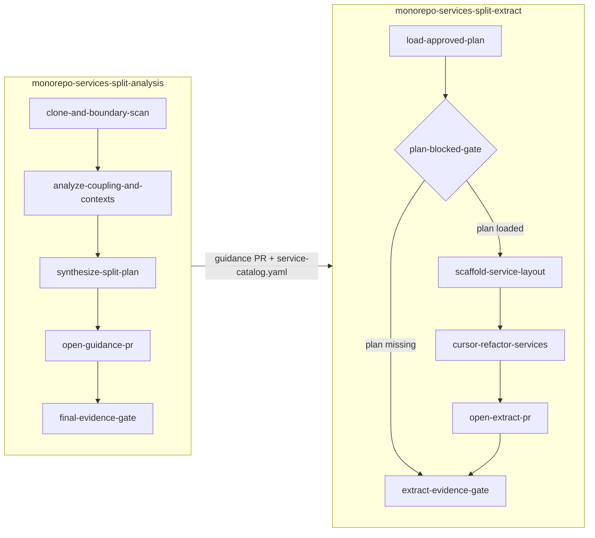

# Monorepo services split (`aios-agent-monorepo-services-splitter`)

Application monolith → microservices guidance and optional extraction for **Go, Java, JavaScript, and TypeScript** monorepos. The module provisions Guild agents, **two workflows**, evidence checklists, and deterministic Ubuntu script runners that clone the target repo and open PRs back to the **same GitHub repository** (never push to the default branch).

**Module source:** [`modules/aios-agent-monorepo-services-splitter`]({{ site.github.repository_url }}/tree/main/modules/aios-agent-monorepo-services-splitter)

**Runnable demo:** [`examples/scenarios/monorepo-services-split`]({{ site.github.repository_url }}/tree/main/examples/scenarios/monorepo-services-split) — `make demo SCENARIO=monorepo-services-split`

---

## When to use it

| Customer situation | Use this module |
|--------------------|-----------------|
| "We have a monolith — how should we split it into services?" | **Analysis workflow** first |
| "We approved a split plan — scaffold `services/<name>/` and open an extract PR" | **Extract workflow** (after analysis) |
| "Split our Terraform state **and** our application code" | Pair with [`aios-agent-db-state-splitter`]({{ site.github.repository_url }}/tree/main/modules/aios-agent-db-state-splitter) — IaC grouping vs. application boundaries |

---

## Two workflows (analysis before extract)

The split is intentionally **two phases**. Extract refuses to cold-start without an approved plan.



### 1. `monorepo-services-split-analysis`

**Purpose:** Facts before judgment — clone, deterministic boundary scan, DDD-informed synthesis, guidance PR.

**Typical chat prompt:**

```text
Analyze https://github.com/org/monorepo for microservices split — DDD bounded contexts
```

**Stages:**

| Stage | What happens |
|-------|----------------|
| `clone-and-boundary-scan` | Ubuntu (or optional remote runner) clones repo, runs `boundary-scan.sh` + CCE critical-path scans, provisions JDK/Go/Node via apt, runs baseline tests from `test_inventory` |
| `analyze-coupling-and-contexts` | Domain analyst interprets scan facts (bounded contexts, coupling heat) |
| `synthesize-split-plan` | Service catalog, migration phases, per-service test strategy |
| `open-guidance-pr` | Commits `docs/architecture/` artifacts + repo-root [`AGENTS.md`](https://agents.md/) |
| `final-evidence-gate` | Submits analysis evidence checklist |

**Guidance PR artifacts (under `docs/architecture/`):**

- `service-catalog.yaml` — proposed services with rationale
- `bounded-context-map.mermaid`
- `coupling-matrix.json`
- `migration-phases.md`
- Repo-root **`AGENTS.md`** — setup, tests, conventions for IDE agents

### 2. `monorepo-services-split-extract`

**Purpose:** Load an **approved** plan, scaffold `services/<name>/`, optionally delegate refactor to Cursor, open extract PR.

**Typical chat prompt (after analysis):**

```text
Extract services from approved plan at docs/architecture/service-catalog.yaml
```

**Required notes / inputs:**

- `github_repo_url`
- **`plan_artifact_path`** (e.g. `docs/architecture/service-catalog.yaml`) **or** `prior_workflow_run_id` from a completed analysis run

**Plan gate:** If neither plan path nor prior run id exists, `load-approved-plan` sets `blocked:missing_plan_artifact` and `plan-blocked-gate` skips scaffold, Cursor, and extract PR. This is **expected** when someone asks to "break down" a repo but triggers extract instead of analysis.

---

## Agents

| Agent | Role |
|-------|------|
| `monorepo-split-architect` | Coordinator — spawns Ubuntu script runners only; never inline shell on embed stages |
| `split-domain-analyst` | LLM synthesis on `boundary_scan.json` — no clone/shell |
| `cursor-split-executor` | Optional — when `enable_cursor_integration = true` |

---

## Script pack and runners

Deterministic work lives in `scripts/` (version **20260604.5**). The bootstrap B64 and script-pack tarball are set on the **Ubuntu integration** when you apply this module (`MONOSPLIT_SCRIPT_PACK_TARBALL_B64`, `CCE_PACK_B64` when CCE is enabled) — workflows do **not** clone tooling repos at runtime. Runners receive a short decode command (~300 chars) via spawn context and run **one `execute_series`** (no LLM `create_files` paste). The Ubuntu container is shared across runs — per-run state under `/home/integration/.<workflow_run_id>/` only.

| Script | Stage |
|--------|-------|
| `stage-runner.sh` + `boundary-scan.sh` | Analysis — clone + structural scan |
| `monorepo-cce-scan.sh` | Analysis — `cce plan` + scoped `cce run -recipes` on critical-path dirs ([`aios-cce-scripts`](../modules/aios-cce-scripts/)) |
| `runtime-deps-provision.sh` | Installs OpenJDK, Go, Node, and **adaptive build tools** (Maven, Gradle, pnpm, yarn); runs baseline tests |
| `agents-md-scaffold.sh` | Repo-root `AGENTS.md` from scan |
| `scaffold-services.sh` | Extract — validated `services/<name>/` skeletons |
| `clone-and-pr.sh` | Guidance and extract PR bodies from committed diff |

Both workflows set Guild execution metadata for cost control: `halguard_skip_subagent_task_types=terminal_calling`, `terminal_calling_halguard_mode=paste_only_minimal_planner`, `planner_max_tool_iterations=12`. PostCheck still runs on runner stdout and architect/analyst synthesis.

Extract scaffold must set `scaffold_layout_validated=true` before an extract PR is opened.

### CCE-enhanced boundary scan (default on)

When `enable_cce_enhanced = true` (default), clone-and-scan runs [Code Context Engine (CCE)](https://github.com/appcd-dev/cce) via embedded [`aios-cce-scripts`](../modules/aios-cce-scripts/):

| Tier | Who | What |
|------|-----|------|
| Deterministic | Ubuntu / optional remote runner | `boundary-scan.sh` + `monorepo-cce-scan.sh`: structural facts, `cce plan`, scoped `cce run -recipes` |
| Analyst LLM | `split-domain-analyst` | Reads **`boundary_scan_summary`** + **`cce_summary` only** — never full entitlement arrays |
| Targeted rescan | architect spawns runner | When analyst notes `cce_rescan_spec`, optional custom lens → scoped CCE |

Default recipes: `cloud-entitlements`, `microservice-decomposition`, `monorepo-intelligence`. Skip with `enable_cce_enhanced = false` or `MONOREPO_SPLIT_SKIP_CCE=1` on the Ubuntu integration. Detail: [`cce-powers.md`](../modules/aios-agent-monorepo-services-splitter/docs/cce-powers.md) and [CCE × AIOS integration map]().

### Optional remote runner

For very large monorepos, set `create_remote_runner = true` and optionally `force_remote_runner = true` to route embed stages to **aiden-runner** instead of the shared Ubuntu integration. Script pack and git credentials sync via vault secret refs. Outputs include `remote_runner_cli_start_command` and `remote_runner_helm_install_command`.

### Script pack version mismatch (`runner_sha256_mismatch`)

If a run fails with `script_pack_error=runner_sha256_mismatch`, the Ubuntu integration env does not match this module's `script_pack_version` — **not** fixable inside a running workflow. Re-apply this Terraform module, then compare `workflow_run_id`, `script_pack_version`, and expected vs actual SHA-256 from runner stderr. Workflow agents report the mismatch only; integration container lifecycle is a Guild/platform concern.

---

## Unit tests as confidence gates

`boundary_scan.json` includes `test_inventory`, `test_frameworks`, `packages_without_tests`, and `test_confidence_score`. Analysts must not recommend cuts through high-coupling, untested packages without a tests-first strangler phase.

| Language | Gate |
|----------|------|
| Go | `go test ./... -race -count=1`; table-driven `*_test.go` |
| Java | JUnit 5 under `src/test/java`; Gradle/Maven `test` task |
| JS/TS | Vitest/Jest/Mocha from `package.json`; per-package coverage in monorepos |

---

## Terraform wiring

```hcl
module "monorepo_services_splitter" {
  source = "github.com/appcd-dev/solutions//modules/aios-agent-monorepo-services-splitter?ref=main"

  model_names = module.foundation.model_names
  policy_ids  = { dangerous_ops = module.policies.policy_ids.dangerous_ops }

  github_secret_id = module.github_integration.secret_id

  integration_names = {
    github     = module.github_integration.integration_name
    ubuntu_cli = module.ubuntu_integration.integration_name
  }

  enable_cursor_integration            = false
  existing_cursor_mcp_integration_name = "" # required when enable_cursor_integration = true
  enable_github_webhook                = false # targets analysis workflow when true

  # CCE Tier-1 recipes + lens add-on (see cce_recipes / cce_lens_use_cases)
  enable_cce_enhanced = true

  # Optional: aiden-runner for very large monorepos
  # create_remote_runner = true
  # force_remote_runner  = true
}
```

**Requirements:** StackGen provider `>= 0.1.25`, `aios-foundation` (or `aios-foundation-bedrock`), `aios-policies` (`dangerous_ops`), GitHub + Ubuntu integrations.

### Key variables

| Variable | Default | Meaning |
|----------|---------|---------|
| `enable_cce_enhanced` | `true` | Wire `aios-cce-scripts` + CCE pack scan during boundary scan |
| `cce_recipes` | cloud + microservice-decomposition + platform-adoption | Catalog recipe ids for `cce run -recipes` |
| `cce_lens_use_cases` | monorepo-intelligence + integration-replatforming | Lens slugs via `cce-scan.sh` (releases.stackgen.com); empty disables add-on |
| `cce_critical_path_max_dirs` | `8` | Max scoped directory passes on large repos |
| `cce_full_tree_max_files` | `800` | Full-tree CCE when `cce plan` count is at or below this |
| `create_remote_runner` | `false` | Register `sg_remote_runner` via `aios-remote-runner` |
| `force_remote_runner` | `false` | Use remote runner `execute_series` instead of Ubuntu |
| `default_split_strategy` | `ddd` | Fallback when workflow inputs omit strategy (`ddd` \| `layer` \| `team_topology`) |
| `max_recommended_services` | `12` | Cap on proposed microservices in analyst synthesis |

**Key outputs:** `workflow_names`, `agent_names`, `github_integration_name`, `ubuntu_integration_name`, `readonly_default_policy_id`, `cce_pack_version` (when CCE enabled), optional `webhook_id` / `webhook_token`, optional `remote_runner_*` install commands.

---

## SE talk track (5 minutes)

1. Open Guild → find **`monorepo-split-architect`** and the two workflows.
2. Run **`monorepo-services-split-analysis`** with a public monorepo URL.
3. Show **`clone-and-boundary-scan`** — Ubuntu runner, `boundary_scan.json`, runtime provisioning (not ad-hoc chat).
4. Show analyst output — bounded contexts, service catalog, migration phases.
5. Show the **guidance PR** on the same repo. Mention extract only after the customer approves the plan.

Full scenario script: [`examples/scenarios/monorepo-services-split/README.md`]({{ site.github.repository_url }}/blob/main/examples/scenarios/monorepo-services-split/README.md).

---

## Operational checklist

1. Run **`monorepo-services-split-analysis`** on the target repo URL.
2. Review and merge (or approve) the **guidance PR**.
3. Seed notes for extract: `plan_artifact_path` or `prior_workflow_run_id`, plus `github_repo_url`.
4. Run **`monorepo-services-split-extract`**.
5. Verify extract PR includes validated scaffold layout and per-service test stubs.

**Common mistake:** Chat message like "break this repo down" routed to **extract** → blocked at `load-approved-plan`. Re-run with **analysis** first.

---

## Related docs

| Doc | Purpose |
|-----|---------|
| [SE Playbook — monorepo-services-split]() | One-command demo |
| [Module Catalog]() | Filter `monorepo`, `microservices`, `ddd` |
| [DB state split module]({{ site.github.repository_url }}/tree/main/modules/aios-agent-db-state-splitter) | Terraform/OpenTofu state grouping (complementary) |
| [CCE × AIOS integration map]() | Which agent modules run which CCE usage guides |
| [`cce-powers.md`](../modules/aios-agent-monorepo-services-splitter/docs/cce-powers.md) | CCE fields in `boundary_scan.json` and operator variables |
