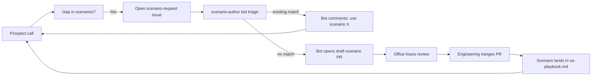

# Solutions engineer feedback loop

This repo only stays useful for solutions engineers if the solutions engineers themselves shape it. That means a real feedback loop — not "file an issue when you have time" — with named owners, a recurring slot on the calendar, an automated triage bot, and a public log of what shipped.

## The loop

> The `scenario-author` agent ([`modules/aios-agent-scenario-author`]({{ site.github.repository_url }}/tree/main/modules/aios-agent-scenario-author)) reacts to every new `scenario-request` issue: it searches existing scenarios, and if none fit it scaffolds the new scenario under `examples/scenarios/<slug>/`, runs `tofu fmt` + `tofu validate`, opens a PR, and comments back on the issue with the PR URL. Humans only step in to review the draft PR (or fix it when validation fails). See the module's README for the full state machine + recovery paths.

## Channels

- **Slack:** `#aios-modules-se` (request a scenario, ask about a pitch, share what worked on a call).
- **Office hours:** **Wednesdays, 11:00 PT, 30 min** (recurring; calendar invite owned by the engineering lead). Skip when nothing is queued — pinging Slack the day before counts as your RSVP. If office hours are not yet on your calendar, ping `#aios-modules-se` to be added.
- **Async triage:** new [scenario-request issues]({{ site.github.repository_url }}/issues?q=is%3Aissue+label%3Ascenario-request) are reviewed in office hours; urgent prospect-driven ones get tagged `urgent` and ship out of band.

## Filing a scenario request

When a prospect asks something we do not have a one-command demo for, **open a scenario-request issue** rather than improvising on the call.

[**Open a scenario request →**]({{ site.github.repository_url }}/issues/new?template=scenario-request.md)

The template prompts for the prospect industry, what they asked, which integrations they already have, and the ideal demo length. The `scenario-author` bot uses those answers to either:

- **Match against an existing scenario** — bot comments with the scenario name, the `make demo SCENARIO=<name>` command, and a link to its README. No new PR.
- **Scaffold a new scenario PR** — bot writes the five files (`main.tf`, `variables.tf`, `outputs.tf`, `terraform.tfvars.example`, `README.md`) and updates `scripts/demo.sh`, runs `tofu fmt -recursive` + `tofu init -backend=false` + `tofu validate`, opens a PR linking the issue, and comments back with the PR URL. If validation fails the PR is opened as `[draft]` with the error inlined.

Either way you get a reply within minutes — well before office hours. Office hours then become "review what the bot scaffolded" rather than "did anyone see this issue?".

## Owners

Per-scenario owners are pinned in [`CONTRIBUTORS-SE.md`]({{ site.github.repository_url }}/blob/main/CONTRIBUTORS-SE.md). Ping the owner directly when you need a quick answer about *their* scenario instead of waiting for office hours.

## Past interviews & decisions

The first interview is captured under [SE interview prep]() — that page is the prep doc and template; the actual answers get appended here under dated headings as the loop runs.

> Engineers: when you run an interview, paste the bullet-list summary below with a date heading. Keep entries short (5–10 bullets); link to the recording or Linear ticket for the detail.

### YYYY-MM-DD — first interview (placeholder)

- *Pending — see the interview prep doc.*

## Monthly usage reports

A short, dated report goes into [`docs/se-usage-reports/`]({{ site.github.repository_url }}/tree/main/docs/se-usage-reports) at the end of each month. Engineers maintain the directory; SEs review during office hours and call out where the data misses reality. The template lives at [`docs/se-usage-reports/TEMPLATE.md`]({{ site.github.repository_url }}/blob/main/docs/se-usage-reports/TEMPLATE.md).

## What this page is not

- It is not a place to capture confidential prospect details. Use Linear / the CRM. Scenario requests should be sanitized so the issue can stay public.
- It is not the place for general module bugs — open a normal issue without the `scenario-request` label.
