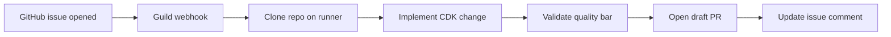

# CDK bot — GitHub issue to reviewed draft PR

Turn a **GitHub issue** describing an AWS CDK change into a **draft pull request** that already passed lint, typecheck, synth, tests, and security checks — without asking your team to run those commands by hand.

**Module:** [`aios-agent-cdk-bot`](../../../modules/aios-agent-cdk-bot) · **Workflow:** `cdk-app-update` · **Agent:** `cdk-module-manager`

---

## In plain English

Someone opens a GitHub issue on your CDK repo (“add a versioned archive bucket”, “turn on encryption on this stack”). **CDK bot** reads it, checks out the code on a secure worker, makes the change, runs the same quality checks your CI would run, and opens a **draft PR** for humans to review.

You stay in control: nothing merges automatically. The bot’s job is to do the repetitive work and only surface a PR when the checks pass.

### Explain like I’m five

Imagine you ask a helper to fix a LEGO model from a note on the fridge. The helper:

1. **Gets the box** (clones your repo)
2. **Builds what the note says** (implements the CDK change)
3. **Checks it doesn’t fall apart** (lint, tests, synth, security scan)
4. **Leaves a labeled tray on your desk** (draft PR + a progress comment on the issue)

If something is wrong, the helper updates the issue comment so you know where it stopped — instead of silently failing.

---

## What success looks like (on GitHub)

You do **not** need to read server logs to know if it worked.

| Where to look | What you should see |
|---------------|---------------------|
| **Issue comment** | A `### cdk-bot workflow progress` table that moves from *running* → *done* on clone, implement, validate, PR |
| **Issue comment (end)** | `module_quality_summary: PASS` and a link to a **draft PR** |
| **Pull requests** | New **draft** PR on a branch like `cdk-bot/...` |
| **Guild watch page** | Workflow `cdk-app-update` finished; stages `clone`, `implement-cdk`, `validate` completed |

If you only see “clone done” and nothing else, the run did **not** succeed end-to-end — see [Troubleshooting](#troubleshooting).

---

## Who this is for

| Audience | Use this README for |
|----------|---------------------|
| **Product / platform leads** | What the bot promises and how to judge a demo |
| **SRE / DevOps** | Install, runner, webhooks, bring-up |
| **Developers** | Test matrix, scripts, module variables |

---

## How it works (simple flow)



**Quality bar (all must PASS before PR):** lint · typecheck · `cdk synth` · cfn-lint · unit tests · cdk-nag.

---

## Quick start (install the bot)

From this folder:

```bash
cd examples/scenarios/cdk-bot
cp terraform.tfvars.example terraform.tfvars
# Edit: stackgen_url, stackgen_token, github_token
tofu init && tofu apply
```

You need:

- A **StackGen / Guild** tenant ([provider](https://github.com/appcd-dev/terraform-provider-stackgen) `>= 0.1.25`)
- A **GitHub token** with `repo` scope (clone, branch, PR, issue comments)
- A **CDK TypeScript repo** you can push to (fork of a demo repo is fine)
- **Docker** on the machine that runs the remote worker (see below)

After apply, note the outputs — especially `webhook_ingress_payload_url` and `remote_runner_docker_run_command`.

---

## Run a demo (recommended order)

**Important:** Start the **remote runner** before triggering a webhook. If the runner is offline, clone may succeed in logs but implement/PR steps fail or time out.

### 1. Start the worker

```bash
cd examples/scenarios/cdk-bot
./scripts/start-runner.sh --run
```

Keep this terminal open. The runner connects to Guild and runs `git`, `npm`, `cdk`, etc. on your behalf.

**Local Guild dev-edge (`localhost:8088`):** use `sks.auto.tfvars` (or set `stackgen_url` / `stackgen_insecure`) and apply from this scenario; `start-runner.sh` rewrites `localhost` to `host.docker.internal` inside Docker.

### 2. Trigger a test issue

**Brownfield (simplest first run)** — edit an existing stack file:

```bash
./scripts/trigger-webhook.sh --from-tofu-output --create-github-issue \
  --repo YOUR_ORG/cdk-typescript-demo \
  --title "Enable KMS on SampleStack $(date +%H%M%S)" \
  --body "Enable KMS encryption on the S3 bucket in lib/sample-stack.ts. Test $(date +%Y%m%d-%H%M%S)."
```

**Greenfield (stricter test)** — add new construct files only:

```bash
./scripts/trigger-greenfield-g1.sh --repo YOUR_ORG/cdk-typescript-demo
```

Always use **`--create-github-issue`** (or `trigger-greenfield-g1.sh`, which creates one for you). Without a real issue, progress comments hit GitHub **404** and the demo looks broken.

### 3. Watch progress

- **Guild UI:** workflow `cdk-app-update`, agent `cdk-module-manager`
- **GitHub:** the issue’s progress comment and eventually a draft PR

### 4. Script-only smoke test (no LLM)

To verify the runner script pack without spending tokens:

```bash
./scripts/local-run-t2.sh   # brownfield KMS on sample-stack.ts
./scripts/local-run-g1.sh   # greenfield file creation (when stable)
```

---

## Demo scripts

| Script | Purpose |
|--------|---------|
| [`scripts/demo.sh`](scripts/demo.sh) | One-screen cheat sheet of scenario IDs |
| [`scripts/start-runner.sh`](scripts/start-runner.sh) | Print or run the aiden-runner Docker command |
| [`scripts/trigger-webhook.sh`](scripts/trigger-webhook.sh) | Fire webhook; use `--create-github-issue` |
| [`scripts/trigger-greenfield-g1.sh`](scripts/trigger-greenfield-g1.sh) | Preferred greenfield scenario (explicit file paths + token) |
| [`scripts/local-run-t2.sh`](scripts/local-run-t2.sh) | Deterministic brownfield script-pack test |
| [`scripts/local-run-g1.sh`](scripts/local-run-g1.sh) | Deterministic greenfield script-pack test |

---

## Test scenarios (what to try)

Full matrix: [`modules/aios-agent-cdk-bot/docs/workflow-test-inputs.md`](../../../modules/aios-agent-cdk-bot/docs/workflow-test-inputs.md).

| ID | Best for | Trigger | Expected outcome |
|----|----------|---------|------------------|
| **G1** | Greenfield demo | `./scripts/trigger-greenfield-g1.sh` | New `lib/gf-archive-bucket-*.ts` + test; draft PR |
| **T2** | Brownfield demo | `./scripts/trigger-webhook.sh` + KMS body on `lib/sample-stack.ts` | Edits existing stack; draft PR |
| **T3** | Catalog / Template I | Issue label `cdk-construct-request` on catalog repo | Scaffold new construct in catalog layout |

Fixture layouts: [`examples/fixtures/cdk-repos/`](../../fixtures/cdk-repos/).

---

## Outputs (after `tofu apply`)

| Output | Use |
|--------|-----|
| `webhook_ingress_payload_url` | Wire to GitHub (or `trigger-*.sh --from-tofu-output`) |
| `remote_runner_docker_run_command` | `start-runner.sh` |
| `workflow_name` | `cdk-app-update` in Guild |
| `agent_names` | Includes `cdk-module-manager` |
| `runner_docker_image` | Toolchain image (CDK, Node, linters) |

---

## Prerequisites checklist

- [ ] Guild / StackGen URL and token
- [ ] GitHub PAT with `repo` scope
- [ ] Target repo exists and token can push branches
- [ ] `tofu apply` completed successfully
- [ ] Remote runner **running and online** in Guild before webhook
- [ ] Real GitHub issue created for each test run (not a fake issue number)

Optional:

- **AWS validation** — set `enable_aws_validation = true` only when synth needs live AWS lookups ([module README](../../../modules/aios-agent-cdk-bot/README.md))
- **Catalog repos** — `cdk_catalog_repository_full_names` + label `cdk-construct-request`

---

## Troubleshooting

| Symptom | Likely cause | What to do |
|---------|--------------|------------|
| Progress comment **Failed 404** | Webhook used a **fake issue number** (`trigger-webhook.sh` without `--create-github-issue`) | Re-run with `--create-github-issue` or `trigger-greenfield-g1.sh` |
| **Clone done**, nothing else | Runner offline, or workflow trimmed to clone-only during dev | `./scripts/start-runner.sh --run`; restore full workflow stages in module; re-apply |
| `create-pr-runner` **tool unavailable** | Agent not bound to remote runner after churn | `tofu apply -replace='module.cdk_bot.sg_agent.cdk_module_manager'`; restart runner |
| `implement_edit_verified=true` but **no PR** / `nothing_to_commit` | Edits never landed on disk (greenfield) or PR step skipped | Check runner logs; try brownfield T2 first; see debug bundle on watch page |
| `context canceled` on implement | Guild restart or activity timeout mid-stage | Re-trigger; avoid restarting Guild during a run |
| Wrong agent in logs (`stackgen-sre-investigator`) | Guild **startup** lists all org agents — filter logs by your workflow `trace_id` | Orchestrator for this workflow is always **`cdk-module-manager`** |

**Incremental bring-up:** when testing one stage at a time, any gate with `skip_to = "validate"` requires the `validate` stage to exist in the workflow definition. See [incremental workflow skill](../../../.cursor/skills/incremental-workflow-bring-up/reference.md).

---

## Five-minute talk track

1. **Pain:** CDK changes are easy to propose in issues, expensive to implement and validate consistently.
2. **Promise:** Issue in → draft PR out, with automated quality gates — humans review, not babysit CLI.
3. **Live:** Show issue progress comment updating, then draft PR link.
4. **Safety:** Draft only; dangerous ops policy; no auto-merge.
5. **Ops:** One remote runner per env; `tofu apply` refreshes script pack without rebuilding Docker unless toolchain changes.

---

## Configuration reference

| File | Purpose |
|------|---------|
| [`terraform.tfvars.example`](terraform.tfvars.example) | Template for secrets and options |
| Local dev tfvars | e.g. `stackgen_url = "http://localhost:8088"`, `stackgen_insecure = true` for Guild dev-edge |
| [`main.tf`](main.tf) | Wires foundation, policies, and `aios-agent-cdk-bot` |

---

## Further reading

- [Module README](../../../modules/aios-agent-cdk-bot/README.md) — variables, AWS validation, CI images, script pack
- [Workflow test inputs](../../../modules/aios-agent-cdk-bot/docs/workflow-test-inputs.md) — payloads and T1–T7 matrix
- [Adopt solutions repo](https://appcd-dev.github.io/solutions/adopt/) — how customers compose AIOS modules
