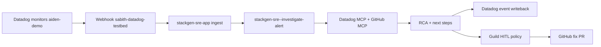

# PoC demo runbook — aiden-demo + Datadog + GitHub + SRE app

Workshop guide for the **Incident Triage PoC** story on **aiden-demo** (EKS `developer-eks`, namespace `aiden-demo`). This path uses **Datadog monitors → stackgen-sre-app ingest → Guild investigation workflow → RCA → Datadog writeback → HITL GitHub fix PR**. It is **not** the Grafana `incident-triage` scenario.

This runbook maps to the proprietary **Incident Triage PoC Requirement** PDF: RCA in ~2 minutes, single prompt, accuracy measurement, knowledge graph, prior incidents, and tuning honesty.

---

## Architecture

Reference workload: [stackgen-demo/order-service](https://github.com/stackgen-demo/order-service) multi-service mesh in `aiden-demo` (order, payment, catalog, ad, chaos-monkey, Datadog agent US3).



---

## Required solutions and repos

| Layer | Artifact | Role |
|-------|----------|------|
| K8s | [stackgen-demo/order-service](https://github.com/stackgen-demo/order-service) (+ payment, catalog, ad) | Fault injection, JSON logs, traces, NetworkPolicy |
| Terraform | `solutions/examples/scenarios/datadog-aws-rca` | GitHub integration, `aios-sre-app-bindings` |
| App | [stackgen-sre-app](https://github.com/appcd-dev/guild-apps/stackgen-sre-app) (Guild install) | Ingest, investigate, discovery, UI |
| Platform | Guild (`ai.dev` or dev-edge) | Workflows, policies, memory, playback |
| Integrations | Datadog (onboarding), GitHub (scenario) | Signals + fix PR |
| Optional | AWS, Slack, FinOps, `shared:incidents` | Not in default `sks.auto.tfvars` |

### Minimum checklist before a customer workshop

1. **stackgen-sre-app** installed with Datadog wired (integration name `datadog`).
2. `tofu apply` in `examples/scenarios/datadog-aws-rca`.
3. **aiden-demo** stack deployed on EKS (`deploy-aiden-demo-stack.sh`).
4. **Datadog monitors** applied (`apply-datadog-monitors.sh` → `@webhook-sabith-datadog-testbed`).
5. **Webhook URL** fixed (remove `_DELETE_THIS` suffix if present).
6. **Discovery** run once in the SRE app (topology / KG seed).
7. **Optional:** `shared:incidents` + [seed past incidents](#seed-past-incidents) for prior-incident search.

---

## Pre-demo setup

From [stackgen-demo/order-service](https://github.com/stackgen-demo/order-service):

```bash
# Datadog API key secret + full aiden-demo stack
./scripts/apply-datadog-secret.sh
./scripts/deploy-aiden-demo-stack.sh

# Eight monitors → @webhook-sabith-datadog-testbed (US3)
./scripts/apply-datadog-monitors.sh

# Preflight / full demo helper
./scripts/run-incident-triage-demo.sh preflight
./scripts/run-incident-triage-demo.sh full   # optional dry run
```

From **solutions** repo:

```bash
cd examples/scenarios/datadog-aws-rca
tofu init && tofu apply   # GitHub + SRE app bindings
```

**Fix Datadog webhook** (Integrations → Webhooks): ensure the URL for `sabith-datadog-testbed` has no stray suffix and points at the SRE app ingest endpoint.

**SRE app Discovery:** open Discovery in the UI and run once so service/label context is available for investigations.

**Guild memory (optional):** provision `shared:incidents` in Guild (not auto-created by the SRE app). See [endpoints-and-guild-integration.md](https://github.com/appcd-dev/guild-apps/stackgen-sre-app/blob/main/docs/endpoints-and-guild-integration.md) and [seed past incidents](#seed-past-incidents) below.

---

## Live demo call script (~25–30 min)

| Act | Time | Talk track |
|-----|------|------------|
| **1. Frame** | 2 min | One alert → one investigation prompt → substantive RCA. No chat ping-pong. |
| **2. Workload** | 3 min | aiden-demo mesh: order → payment / catalog / ad. NetworkPolicy isolates namespace. |
| **3. Fire incident** | 2 min | `./scripts/run-incident-triage-demo.sh fire-schema` or wait for monitor. |
| **4. SRE app investigate** | 8 min | Ingest → Investigate → RCA (`DatabaseSchemaMismatch` → `cmd/initdb/main.go`). |
| **5. Closed loop** | 5 min | `./scripts/run-incident-triage-demo.sh fire-schema` → Investigate → **two** Guild HITL approvals (Datadog writeback, then GitHub PR on `stackgen-demo/order-service`). |
| **6. Platform depth** | 5 min | Workflows, policies, Discovery/KG, optional prior incidents. |
| **7. PoC honesty** | 3 min | Batch eval + human scorecard for procurement (see PDF mapping). |

### URL cheat sheet

| Surface | Where |
|---------|--------|
| SRE alerts / investigate | SRE app UI (via Guild dev-edge, e.g. `/app/sre/alerts`) |
| Discovery | SRE app Discovery page |
| Datadog monitors / logs / APM | `us3.datadoghq.com` — filter `service:order-service env:demo` |
| Guild workflows / executions | Guild UI — `stackgen-sre--investigate-alert` |
| Golden fix file | [order-service `cmd/initdb/main.go`](https://github.com/stackgen-demo/order-service/blob/main/cmd/initdb/main.go) |

---

## Closed-loop demo script (schema fault)

Use this sequence for a reproducible PoC — **same** `stackgen-sre--investigate-alert` run ends with Datadog writeback + GitHub PR:

1. **Preflight:** aiden-demo stack up, `[aiden-demo]` monitors only (mute unrelated `api-gateway` webhooks), Discovery run once, `enable_policies = true` after `tofu apply`.
2. **Fire:** `./scripts/run-incident-triage-demo.sh fire-schema` (order-service repo).
3. **Investigate:** SRE app → alert → **Investigate** (or auto-investigate if enabled).
4. **Trace checks:** `signals-change` probes `stackgen-demo/order-service` commits; RCA names `DatabaseSchemaMismatch` / `cmd/initdb/main.go`.
5. **HITL 1:** Guild → approve Datadog writeback (`sre-copilot--investigation-write-gate`).
6. **HITL 2:** Guild → approve GitHub PR (`gh pr create` gated).
7. **Verify:** Datadog monitor comment/event + open PR on `stackgen-demo/order-service`.

**Dependency / timeout faults** (`fire-dependency`, payment-service gRPC): closed-loop still runs — Datadog writeback is attempted and `remediation_plan.skipped_pr=true` with a dependency reason; **no** GitHub PR on `order-service` when the synced playbook classifies the scenario as downstream infra, not order-service code.

Outputs: `demo_golden_fix_url`, `service_repository_map` from this scenario's Terraform apply.

---

## PoC PDF requirement mapping

| PDF success criterion | Status | Mitigation |
|----------------------|--------|------------|
| RCA in ~2 min | **Partial** | Measure with [poc-eval](https://github.com/appcd-dev/guild-apps/stackgen-sre-app/blob/main/scripts/poc-eval/README.md); internal synthetic p50 ~140–178s |
| Single prompt | **Have** | Investigation is one prompt; writeback + fix PR need two HITL clicks in the same run |
| Accuracy measurement | **Partial** | `stackgen-sre-app/scripts/poc-eval` + human scorecard — aiden-demo JSONL is new; wire into eval v2 |
| Prior incidents | **Partial** | Requires `shared:incidents` + [bootstrap](#seed-past-incidents) |
| Knowledge graph | **Partial** | Discovery → graph ingest (manual run before demo) |
| Category coverage | **Partial** | Strong config/schema + dependency; weak network/AWS/data — see [incident-triage-poc-limits.md](../../docs/incident-triage-poc-limits.md) |
| Tuning / feedback loop | **Partial** | Scorecard + JSONL updates; not fully automated for aiden-demo yet |

---

## Blind spots

### Infrastructure / wiring

- Broken Datadog webhook URL (`_DELETE_THIS` suffix).
- `enable_datadog_alert_webhook = false` in tfvars — webhook must exist manually.
- Discovery not run — investigations lack topology context.
- `enable_policies = false` in tfvars — scenario default is **true**; only disable when policies already attached.
- No AWS role — cloud signals limited to Datadog + GitHub.
- Remote runner not running — only matters if workflow stages require it.
- Chaos monkey timing unpredictable — use `fire-schema` for live demos.
- NetworkPolicy blocks cross-namespace access — by design.
- Log `@error.kind` facet inconsistent — monitors use message text search.

### PoC process

- No customer-owned JSONL eval set for aiden-demo until you adopt `scripts/data/aiden-demo-incidents.jsonl`.
- `shared:incidents` not provisioned by default.
- GitHub fix PR depends on repo discovery + token scope (`repo`, `read:org`).

---

## Platform capabilities to showcase

| Capability | Demo moment |
|------------|-------------|
| Alert → RCA | Datadog monitor → SRE app Investigate |
| Multi-signal | Datadog logs/APM + GitHub `initdb` correlation |
| Dependency faults | payment / catalog / ad leaf errors |
| Governed remediation | Guild HITL before GitHub PR |
| Datadog writeback | RCA posted as Datadog event |
| Discovery / KG | Pre-run Discovery; show service graph |
| Prior incidents | After bootstrap — `prior-incident-search` in trace |
| Audit replay | Guild execution playback |
| Namespace isolation | NetworkPolicy — no cross-namespace egress |
| Batch eval | poc-eval for procurement conversations |

---

## Seed past incidents

Populate **`shared:incidents`** so `prior-incident-search` finds aiden-demo-shaped RCAs during live investigations (PoC PDF requirement 7).

### Two paths

| Path | When | How |
|------|------|-----|
| **Curated bootstrap (primary)** | Before demo / eval | JSONL → `bootstrap-memory.sh` via investigator `memory_store` |
| **Live persist (optional)** | After real investigations | Workflow stage `persist-incident-memory` writes completed RCAs |

### Dataset

Curated rows: [`scripts/data/aiden-demo-incidents.jsonl`](scripts/data/aiden-demo-incidents.jsonl) (schema: [`incident-triage/scripts/incidents.schema.json`](../incident-triage/scripts/incidents.schema.json)).

| id | Category | Golden root cause |
|----|----------|-------------------|
| AIDEN-001 | config | SQLite schema mismatch — `cmd/initdb/main.go` |
| AIDEN-002 | dependency | payment-service `PaymentFailure` |
| AIDEN-003 | dependency | catalog `CatalogRankIndexPanic` |
| AIDEN-004 | dependency | ad-service `AdServiceUnavailable` |
| AIDEN-005 | config | order-service HTTP 5xx from schema path |
| AIDEN-006 | dependency | `DownstreamPaymentTimeout` (timeout fault) |
| AIDEN-007 | config | payment-service `PaymentLogicBug` — valid card rejected (`charge.js` logic_bug) |

### Bootstrap commands

**Prerequisite:** `shared:incidents` namespace provisioned in Guild with investigator admin access.

```bash
cd examples/scenarios/datadog-aws-rca

export GUILD_URL=https://ai.dev.stackgen.com/guild
export GUILD_PROJECT_ID=<your-org-id>
export STACKGEN_TOKEN=<pat>

./scripts/seed-past-incidents.sh
# or stepwise:
./scripts/seed-past-incidents.sh --dry-run
../incident-triage/scripts/bootstrap-memory.sh \
  --dataset scripts/data/aiden-demo-incidents.jsonl \
  --sleep 3
```

**Verify:** Guild Memory Explorer → namespace `shared:incidents` → search `incident_id=AIDEN-001`.

### Optional live reinforcement

After bootstrap, fire a real incident and complete an investigation so `persist-incident-memory` adds agent-generated episodes:

```bash
# order-service repo
./scripts/run-incident-triage-demo.sh fire-schema
# SRE app: Investigate → wait for workflow complete
```

---

## Operational reference

### Fault levels

```bash
./scripts/set-fault-level.sh quiet|normal|noisy|demo|pr-demo|pr-payment-bug
./scripts/reload-fault-profile.sh
```

**Closed-loop PR demos:**

```bash
./scripts/run-incident-triage-demo.sh fire-pr-demo      # order-service schema → GitHub PR
./scripts/run-incident-triage-demo.sh fire-payment-bug  # payment logic_bug → GitHub PR
```

### Pause / resume stack

See [order-service README](https://github.com/stackgen-demo/order-service) — scale chaos-monkey or use demo script `preflight` / `resume`.

### Network policy

[`k8s/network-policy.yaml`](https://github.com/stackgen-demo/order-service/blob/main/k8s/network-policy.yaml) — requires EKS VPC CNI `enableNetworkPolicy: true`.

### Datadog log queries (multi-service RCA)

```
service:order-service env:demo status:error
service:payment-service env:demo PaymentFailure
service:product-catalog-service env:demo CatalogRankIndexPanic
service:ad-service env:demo AdServiceUnavailable
```

### Related docs

- [aiden-demo Datadog playbook (agent service reference)](./playbooks/aiden-demo-datadog-playbook.md)
- [incident-triage-poc-limits.md](../../docs/incident-triage-poc-limits.md)
- [incident-triage-poc-taxonomy.md](../../docs/incident-triage-poc-taxonomy.md)
- [poc-eval README](https://github.com/appcd-dev/guild-apps/stackgen-sre-app/blob/main/scripts/poc-eval/README.md)
- [order-service demo scripts](https://github.com/stackgen-demo/order-service/tree/main/scripts)

---

## Recommended prep before customer workshop

1. Fix Datadog webhook URL.
2. Run SRE app **Discovery** once.
3. Provision `shared:incidents` and run `./scripts/seed-past-incidents.sh`.
4. Run one poc-eval timing pass on `AIDEN-001` prompt shape.
5. Set `enable_policies = true` if showing Terraform HITL in Guild.
6. Rehearse `fire-schema` → Investigate → writeback → PR once end-to-end.
7. Confirm monitors green on `quiet` fault profile; switch to `normal` only if you want ambient noise.
