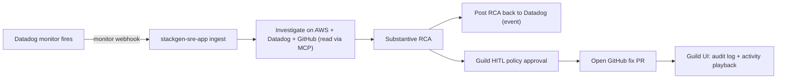

# Scenario: `datadog-aws-rca`

> Pre-sales pitch: **"A Datadog monitor fires at 2am — what does your thing actually do?"**

A Datadog alert is ingested, Aiden investigates it against AWS, writes the root
cause **back into Datadog as an event**, and opens a **policy-gated GitHub fix
PR** from the RCA. A weekly FinOps review is wired alongside for the
cost-management wow factor.

This is a **two-surface demo**:

- **stackgen-sre-app UI** — Datadog/AWS/GitHub discovery, alert ingest,
  investigation, substantive RCA, RCA-to-Datadog writeback, fix PR.
- **Guild platform UI** — policy guardrails, workflows, cost management, audit
  logs, and activity playback.

This Terraform root provisions policy guardrails and **creates GitHub** (plus
optional AWS / Slack / FinOps). **Datadog is not created here** — it is looked up
via `data.sg_guild_integration` (default name `datadog` from SRE app onboarding)
and preserved on the app install via `data.sg_app` merge in `aios-sre-app-bindings`.
It does **not** register LLM models — the **stackgen-sre-app** install owns
investigator model wiring.

## Flow



## What this provisions (Terraform)

| Module | Purpose |
|--------|---------|
| `aios-policies` | Guardrails (default **true** — includes `sre-investigation-write-gate` for HITL on writeback + fix PR) |
| `data.sg_app` + `data.sg_guild_integration` | Lookup existing SRE app + Datadog integration from onboarding |
| `aios-integration-github` | GitHub SCM integration (repo context + RCA fix PR) — **created by this root** |
| `aios-integration-aws` | Optional AWS MCP integration (when `aws_role_arn` is set) |
| `aios-integration-slack` | Optional Slack integration |
| `aios-agent-cost-optimizer` + `aios-agent-schedules` | Optional FinOps review + weekly cron |
| `aios-sre-app-bindings` | Merges GitHub (and optional AWS / Slack) onto existing SRE app bindings via `sg_app` |

## Prerequisites

- OpenTofu (`tofu`) or Terraform on PATH.
- A Guild tenant URL + PAT (`STACKGEN_URL`, `STACKGEN_TOKEN`).
- **stackgen-sre-app** installed with Datadog already wired (integration name defaults to `datadog`).
- A GitHub PAT with `repo` + `read:org` scope (needed to open the fix PR).
- Optional: AWS role ARN when cloud investigation is in scope.

## Run

From the repo root:

```bash
make demo-doctor SCENARIO=datadog-aws-rca
make demo        SCENARIO=datadog-aws-rca
```

Or directly:

```bash
cd examples/scenarios/datadog-aws-rca
cp terraform.tfvars.example terraform.tfvars   # then fill in values
tofu init && tofu apply
```

## Demo runbook

> Full PoC workshop guide: [POC-DEMO-RUNBOOK.md](./POC-DEMO-RUNBOOK.md) — aiden-demo live path, PDF mapping, blind spots, and [seed past incidents](./scripts/seed-past-incidents.sh).

### 1. Apply this scenario

Provisions policies and the GitHub integration, then merges GitHub onto the
existing SRE app bindings (Datadog from onboarding). Show **Policies** and
**Integrations** in Guild.

### 2. Seed the tracked workload (`aiden-demo` namespace / `order-service` APM name)

Deploy from [`stackgen-demo/order-service`](https://github.com/stackgen-demo/order-service).
`k8s/stack.yaml` creates the **`aiden-demo`** namespace, a Datadog Agent (APM +
logs, US3), and four microservices with structured JSON stdout logs. Use the
umbrella script to roll out the full stack:

```bash
# In the order-service repo (after DD_API_KEY secret):
DD_API_KEY=<YOUR_US3_DATADOG_API_KEY> ./scripts/apply-datadog-secret.sh
./scripts/deploy-aiden-demo-stack.sh
```

The stack includes **`aiden-chaos-monkey`** (random fault injection across
order → catalog → ad → payment checkout sagas) and suspends the legacy
`order-service-trigger-fault` CronJob by default.

**Network isolation:** `k8s/network-policy.yaml` blocks cross-namespace traffic
and control-plane/metadata egress from aiden-demo. Requires EKS VPC CNI
`enableNetworkPolicy: "true"` — applied automatically by
`deploy-aiden-demo-stack.sh`.

**Monitor scope (critical):** Only fire **`[aiden-demo]`** monitors from
`stackgen-demo/order-service/scripts/apply-datadog-monitors.sh`. **Mute or retag**
unrelated production monitors (e.g. `api-gateway` in `env:production`) that share
the same Datadog webhook — otherwise ingest picks up the wrong service and
closed-loop remediation targets the wrong repo.

Create (or tag) a Datadog monitor so **query scope** and **monitor tags** both
point at the same APM service. SRE discovery reads **`service:` tags on
monitors** and **`service:` filters inside monitor queries** (for example
`trace.fastapi.request.errors{service:api-gateway}`). Prefer **both** a matching
`service:` tag and query scope so investigations and volume-query hints stay aligned:

| Layer | Value |
|-------|--------|
| APM / traces (`DD_SERVICE`) | `order-service` |
| Env | `demo` (must match `tracked_env` and monitor tags) |
| K8s namespace / Deployment | `aiden-demo` |
| Monitor query | `trace.http.request.hits{service:order-service,...}` |
| Monitor tags (for discovery) | `service:order-service`, `env:demo` |

**Smoke / manual webhook:** if you POST a synthetic Datadog payload (Guild webhook
trigger or SRE ingest), set `tags` to **`service:order-service env:demo`** for
this scenario. Do **not** use production services (`api-gateway`) — investigations
will scope to the wrong repo and skip closed-loop remediation.

Example 5xx monitor (matches the repo README):

```
query: sum(last_5m):sum:trace.http.request.hits{service:order-service,http.status_code:500}.as_count() > 5
tags:  service:order-service, env:demo
```

**Apply all aiden-demo monitors (recommended):** from the order-service repo, create
eight monitors (order, payment, catalog, ad, chaos-monkey) that notify
`@webhook-sabith-datadog-testbed`:

```bash
DD_API_KEY=<us3-api-key> DD_APP_KEY=<us3-app-key> ./scripts/apply-datadog-monitors.sh
```

Re-run the script after changing thresholds; it upserts by monitor name prefix
`[aiden-demo]`.

> The `tracked_target` Terraform output prints the exact `monitor_scope`,
> `datadog_site`, and namespace this scenario is configured for.

### 3. Wire the SRE app

1. **Install** **stackgen-sre-app** and complete Datadog onboarding first (creates the `datadog` integration).
2. Run `tofu apply` with `enable_sre_app_bindings = true` (default). This **merges GitHub** (and optional AWS / Slack) onto existing bindings via **`data.sg_app`** + **`sg_app`**.
3. In the SRE app, confirm Datadog alert ingest is configured (skip Terraform webhook unless `enable_datadog_alert_webhook = true`).
4. In Datadog, ensure monitor webhooks point at the SRE app ingest URL if not already set.

**Optional — Datadog playbook → Guild runbooks:** Run SRE discovery once and note notebook/workflow IDs under **Available playbooks**. Set `runbook_sync_*` keys on the existing `datadog` Guild integration `env` (Terraform `sg_guild_integration` or Guild API). See [stackgen-sre-app `docs/runbook-sync.md`](https://github.com/appcd-dev/guild-apps/stackgen-sre-app/blob/main/docs/runbook-sync.md). Source markdown for an **aiden-demo service reference** notebook: [playbooks/aiden-demo-datadog-playbook.md](./playbooks/aiden-demo-datadog-playbook.md).

### Remote runner — in-cluster Helm (`aiden-demo`)

Install **aiden-runner** in the same cluster as the demo workloads. Chart **0.1.54+**
sets **`podLabels.app: aiden-runner`**; the **aiden-demo stack** must include a
matching egress NetworkPolicy (same pattern as `datadog-agent-us3-egress`) so the
runner can reach mothership over HTTPS when **`aiden-demo-egress-isolation`** is
applied. Without that policy, handshake fails with `dial tcp …:443: i/o timeout`
even though Dev Tunnel URLs are internet-reachable.

```bash
helm upgrade --install aiden-runner \
  --repo https://appcd-public-releases.s3.us-east-2.amazonaws.com/charts/ \
  aiden-runner \
  --version 0.1.54 \
  --set runner.mothershipUrl=https://<your-mothership-host> \
  --set runner.token=<from tofu output> \
  --set rbac.namespaced.enabled=true \
  --set rbac.namespaced.createReadRole=true \
  -n aiden-demo
```

Re-apply the order-service stack so `k8s/network-policy.yaml` includes
`aiden-runner-mothership-egress` and `aiden-runner-kube-api-egress` (selector
`app.kubernetes.io/name: aiden-runner`). Confirm `Runner registered` in logs,
then attach `datadog-aws-rca-runner` to `stackgen-sre-investigator` in Guild.

**Alternative:** run aiden-runner locally (`remote_runner_cli_start_command` from
`tofu output`) with kubeconfig pointed at EKS.

| Log message | Action |
|-------------|--------|
| `missing feature flag key` | Safe to ignore in local dev |
| `dial tcp …:443: i/o timeout` (mothership handshake) | Re-apply `k8s/network-policy.yaml` (`aiden-runner-mothership-egress`) |
| `dial tcp 172.20.0.1:443: i/o timeout` (kubectl) | Re-apply `k8s/network-policy.yaml` (`aiden-runner-kube-api-egress`) |
| `listen tcp :9090: bind: address already in use` (local CLI) | Pass `--metrics-addr 9091` |

### Already-installed SRE app (recommended)

This scenario **does not** recreate Datadog, models, or alert webhooks by default. A typical `tofu plan` adds only GitHub + optional remote runner, then **merges** GitHub onto existing `sg_app` bindings.

If Terraform shows `sg_app.sre will be created` but the app is already installed, import first so apply is an update—not a blind create:

```bash
tofu import 'module.sre_app_bindings[0].sg_app.sre' sre
```

> If the SRE app is not installed yet, set `enable_sre_app_bindings = false`,
> apply the integrations first, install the app, then re-apply with bindings
> enabled. In Guild, attach remote runner `datadog-aws-rca-runner` to agent
> `stackgen-sre-investigator` (Agents tab) after starting aiden-runner — see
> [Remote runner — in-cluster Helm](#remote-runner--in-cluster-helm-aiden-demo).

### 4. Trigger and narrate

Fire the monitor, then in the SRE app walk the panel: **ingest → investigation →
substantive RCA → closed-loop remediation**. Then show:

- **RCA in Datadog** — the root cause appears as an event on the monitor (first HITL approval).
- **Fix PR** — the investigator opens a GitHub PR on `stackgen-demo/order-service`
  (second HITL approval). Golden path: `cmd/initdb/main.go` schema alignment.

**Closed-loop demo script** (order-service repo):

```bash
./scripts/run-incident-triage-demo.sh fire-pr-demo
# or: fire-schema (same schema fault, without quiet profile)
# SRE app → Investigate → Guild Approve (Datadog writeback) → Approve (GitHub PR)
# Verify PR: https://github.com/stackgen-demo/order-service/pulls
```

**Payment logic_bug PR demo** (payment-service image must include `logic_bug`):

```bash
# payment-service repo: PUSH=true ./scripts/deploy-aiden-demo.sh
# order-service repo:
./scripts/run-incident-triage-demo.sh fire-payment-bug
```

### 5. Platform wow factors (Guild UI)

- **Policy guardrails** — the approval you just clicked.
- **Workflows** — the investigate workflow and the FinOps review workflow.
- **Cost management** — the FinOps review output / weekly cron.
- **Audit logs** — the ingest → approval → PR trail.
- **Activity playback** — replay the investigation run in the execution watch UI.

## Variables

See [`variables.tf`](variables.tf) and [`terraform.tfvars.example`](terraform.tfvars.example).
Notable toggles: `enable_policies` (default **true**) — attaches `sre-investigation-write-gate`
for the HITL demo; set false when equivalent policies already exist;
`service_repository_map` — passed to `sg_app.config` as `service_repo_*` keys for
GitHub change correlation and fix PR targeting;
`enable_datadog_alert_webhook` (default **false**) — leave off when Datadog ingest is already wired in the SRE app;
`existing_datadog_integration_name` (default `datadog`) — lookup only, not created; `enable_sre_app_bindings` (default
`true`) — set `false` until stackgen-sre-app is installed in the org;
`register_remote_runner` (default `true`) — set `false` to look up an existing
Guild runner by name instead of registering a new one (use when Create returns 429).

## Pause Datadog ingestion (between demos)

The **`aiden-demo`** Kubernetes stack (from
[`stackgen-demo/order-service`](https://github.com/stackgen-demo/order-service))
is what **sends** APM traces and logs to Datadog. This Terraform root and the
SRE app **do not** ingest metrics — they only read Datadog via API (monitors,
events, MCP). To avoid APM/log billing while you are not actively demoing, pause
the cluster workloads below.

| Workload | Namespace | What it sends |
|----------|-----------|---------------|
| `deployment/datadog-agent` | `aiden-demo` | File-tails JSON stdout logs + APM to US3 |
| `deployment/aiden-demo` | `aiden-demo` | `order-service` — checkout orchestrator |
| `deployment/payment-service` | `aiden-demo` | gRPC payment leaf |
| `deployment/product-catalog-service` | `aiden-demo` | gRPC catalog leaf |
| `deployment/ad-service` | `aiden-demo` | gRPC ad leaf |
| `deployment/aiden-chaos-monkey` | `aiden-demo` | Random checkout/leaf faults (unpredictable timing) |
| `cronjob/order-service-trigger-fault` | `aiden-demo` | **Suspended by default** — manual one-shot only |

You do **not** need to change Terraform, Guild integrations, or SRE app Datadog
sync to save money. Muting monitors in the Datadog UI stops alerts but not
ingestion billing — scale down the agent instead.

### Pause (recommended)

```bash
# Stop random faults first (chaos monkey)
kubectl -n aiden-demo scale deployment/aiden-chaos-monkey --replicas=0

# Stop the forwarder — main cost lever
kubectl -n aiden-demo scale deployment/datadog-agent --replicas=0

# Stop all app workloads
kubectl -n aiden-demo scale deployment/aiden-demo deployment/payment-service \
  deployment/product-catalog-service deployment/ad-service --replicas=0
```

Legacy CronJob (if applied) stays suspended; no need to patch unless you re-enabled it.

### Fault noise levels (shared ConfigMap)

All random fault injection reads **`configmap/aiden-demo-fault-profile`** in
`aiden-demo` (chaos monkey, payment, catalog, ad, and the suspended CronJob).

| Level | Command | Effect |
|-------|---------|--------|
| **quiet** | `./scripts/set-fault-level.sh quiet` | Chaos off; leaf random failures disabled |
| **normal** | `./scripts/set-fault-level.sh normal` | Default demo (45–480s chaos, moderate fractions) |
| **noisy** | `./scripts/set-fault-level.sh noisy` | Short chaos intervals, high leaf failure rates |
| **demo** | `./scripts/set-fault-level.sh demo` | Fast intervals (10–30s) for live audience demos |
| **alerting** | `./scripts/set-fault-level.sh alerting` | **Datadog monitor soak** — 8–25s chaos, burst=5, catalog rank + ad CPU faults |

Run from the [order-service](https://github.com/stackgen-demo/order-service) repo.
After editing the ConfigMap manually, run `./scripts/reload-fault-profile.sh` to
pick up changes.

### Resume before a demo

```bash
kubectl -n aiden-demo scale deployment/datadog-agent deployment/aiden-demo \
  deployment/payment-service deployment/product-catalog-service deployment/ad-service \
  deployment/aiden-chaos-monkey --replicas=1
kubectl -n aiden-demo rollout status deployment/datadog-agent --timeout=120s
kubectl -n aiden-demo rollout status deployment/aiden-demo --timeout=180s
```

### Datadog log queries (multi-service RCA)

```
service:order-service env:demo @error.kind:DatabaseSchemaMismatch
service:order-service env:demo @error.kind:DownstreamPaymentFailure
service:payment-service env:demo @error.kind:PaymentFailure
service:product-catalog-service env:demo @error.kind:CatalogRankIndexPanic
service:ad-service env:demo error.kind:AdServiceUnavailable
service:aiden-chaos-monkey env:demo
```

APM service map should show edges from `order-service` to
`payment-service`, `product-catalog-service`, and `ad-service` after a
`X-Demo-Fault: healthy` checkout.

### Agent only (lighter pause)

Keep the app running locally but stop Datadog ingestion:

```bash
kubectl -n aiden-demo scale deployment/datadog-agent --replicas=0
```

Traces buffer briefly and drop; nothing new is billed.

### Verify paused state

```bash
kubectl -n aiden-demo get deploy,cronjob
```

Expect `datadog-agent` and `aiden-demo` at **0/0** ready and the CronJob
**SUSPEND** column **True**.

### Tear down the whole namespace

```bash
kubectl delete namespace aiden-demo
```

Re-seed when you need the workload again (from the order-service repo):

```bash
DD_API_KEY=<YOUR_US3_DATADOG_API_KEY> ./scripts/apply-datadog-secret.sh
./scripts/deploy-aiden-demo-stack.sh
```

## Cleanup

```bash
make demo-reset SCENARIO=datadog-aws-rca   # destroy + re-apply between demos
# or
cd examples/scenarios/datadog-aws-rca && tofu destroy
```

> Note: the **stackgen-sre-app** catalog install and the Datadog monitor webhook
> are outside Terraform. `tofu destroy` clears integration bindings on the SRE
> app install but does not uninstall the app or remove the Datadog webhook.
> `tofu destroy` also does **not** remove the `aiden-demo` namespace or stop
> Datadog ingestion — use [Pause Datadog ingestion](#pause-datadog-ingestion-between-demos)
> or delete the namespace separately.
