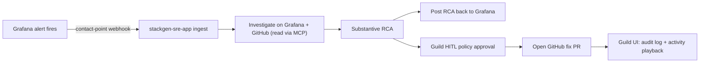

# Scenario: `grafana-github-rca`

> Pre-sales pitch: **"A Grafana alert fires — can you tie it to a bad deploy?"**

A Grafana alert is ingested, Aiden correlates telemetry with GitHub commits and
blame, writes the root cause **back into Grafana**, and opens a **policy-gated
GitHub fix PR** from the RCA.

This is a **two-surface demo**:

- **stackgen-sre-app UI** — Grafana/GitHub discovery, alert ingest,
  investigation, substantive RCA, RCA writeback, fix PR.
- **Guild platform UI** — policy guardrails, workflows, audit logs, and activity
  playback.

This Terraform root provisions the Guild-side pieces the SRE app binds to
(foundation models, policy guardrails, and the Grafana / GitHub / Slack
integrations). The alert ingest, investigation, and RCA UI live in the
**stackgen-sre-app**, which must be **installed** in the tenant before `tofu
apply` can bind integrations (see [Wire the SRE app](#3-wire-the-sre-app)).

## Flow



## What this provisions (Terraform)

| Module | Purpose |
|--------|---------|
| `aios-foundation` | *(not used)* — models come from the installed SRE app |
| `aios-policies` | Full guardrail set (HITL on remediation / PR, write gates, blast radius, freeze window) |
| `aios-integration-grafana` | Grafana MCP integration (read-only telemetry during RCA) |
| `aios-integration-github` | GitHub SCM integration (repo context + RCA fix PR) |
| `aios-integration-slack` | Optional Slack integration (incident channel, approvals) |
| `aios-sre-app-bindings` | Binds Grafana / GitHub / Slack integrations to the installed **stackgen-sre-app** (`sg_app`; toggle with `enable_sre_app_bindings`) |

## Prerequisites

- OpenTofu (`tofu`) or Terraform on PATH.
- A Guild tenant URL + PAT (`STACKGEN_URL`, `STACKGEN_TOKEN`).
- Grafana server URL + service-account token (`GRAFANA_SERVER`, `GRAFANA_TOKEN`).
- A GitHub PAT with `repo` + `read:org` scope (needed to open the fix PR).
- The **stackgen-sre-app** available to install into the tenant.

## Run

From the repo root:

```bash
make demo-doctor SCENARIO=grafana-github-rca
make demo        SCENARIO=grafana-github-rca
```

Or directly:

```bash
cd examples/scenarios/grafana-github-rca
cp terraform.tfvars.example terraform.tfvars   # then fill in values
tofu init && tofu apply
```

## Demo runbook

### 1. Apply this scenario

Provisions models, policies, and the Grafana / GitHub / Slack integrations.
Show the **Policies** and **Integrations** tabs in Guild.

### 2. Seed a tracked workload

Scope Grafana alert rules to the service and environment this demo tracks.
The default is `payments-api` in `demo` env, owned by
`stackgen-demo/order-service`. Override `tracked_service`, `tracked_env`, and
`tracked_github_repo` in tfvars if your demo uses different labels.

> The `tracked_target` Terraform output prints the exact `alert_scope` and
> `grafana_url` this scenario is configured for.

### 3. Wire the SRE app

1. **Install** **stackgen-sre-app** in this tenant (one-time catalog install in
   Guild — not created by this Terraform root).
2. Run `tofu apply` with `enable_sre_app_bindings = true` (default). This
   module binds the Grafana, GitHub, and optional Slack integrations created
   above to the SRE app install via **`sg_app`** (`aios-sre-app-bindings`).
3. In the SRE app onboarding screen, copy the **Grafana alert-ingest URL** (or
   use `tofu output -raw grafana_alert_webhook_trigger_url`).
4. In Grafana, add a **contact point** webhook notification that posts to that
   URL.

> If the SRE app is not installed yet, set `enable_sre_app_bindings = false`,
> apply the integrations first, install the app, then re-apply with bindings
> enabled. In Guild, attach remote runner `grafana-github-rca-runner` to agent
> `stackgen-sre-investigator` (Agents tab) after starting aiden-runner.

### 4. Trigger and narrate

Fire the alert, then in the SRE app walk the panel: **ingest → investigation →
substantive RCA**. Then show:

- **RCA in Grafana** — the root cause appears as an annotation or event on the
  alert.
- **Fix PR** — the investigator proposes a GitHub PR; Guild shows the **HITL
  approval** prompt (policy guardrail). Approve to open the PR.

### 5. Platform wow factors (Guild UI)

- **Policy guardrails** — the approval you just clicked.
- **Workflows** — the investigate workflow.
- **Audit logs** — the ingest → approval → PR trail.
- **Activity playback** — replay the investigation run in the execution watch UI.

## Variables

See [`variables.tf`](variables.tf) and
[`terraform.tfvars.example`](terraform.tfvars.example). Notable toggles:
`enable_sre_app_bindings` (default `true`) — set `false` until
stackgen-sre-app is installed in the org; `enable_grafana_alert_webhook`
(default `true`) — registers the SRE app Grafana ingest webhook via
`sg_sre_alert_webhook`; `register_remote_runner` (default `true`) — set
`false` to look up an existing Guild runner by name instead of registering a new
one (use when Create returns 429).

## Cleanup

```bash
make demo-reset SCENARIO=grafana-github-rca   # destroy + re-apply between demos
# or
cd examples/scenarios/grafana-github-rca && tofu destroy
```

> Note: the **stackgen-sre-app** catalog install and the Grafana contact-point
> webhook are outside Terraform. `tofu destroy` clears integration bindings on
> the SRE app install but does not uninstall the app or remove the Grafana
> webhook.
