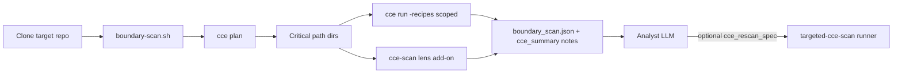

# What CCE adds to the monorepo services splitter

This module’s **clone-and-boundary-scan** stage produces structural facts plus **CCE critical-path scans** via [`aios-cce-scripts`](../../aios-cce-scripts/) (`cce plan`, `cce run -recipes`, and lens use-case passes).

---

## Three-tier pipeline (cost-aware)

| Tier | Who | What |
|------|-----|------|
| **1 — Recipes** | Ubuntu / optional remote runner | `cce run -recipes` on critical-path dirs — catalog ids from `releases.stackgen.com/cce/recipes` |
| **1 — Lens add-on** | Same runner | Separate `cce-scan.sh scan-use-case` per lens slug from `releases.stackgen.com/cce/lenses` |
| **2 — Analyst LLM** | split-domain-analyst | Reads **`boundary_scan_summary`** + **`cce_summary` only** — never full entitlement arrays |
| **3 — Targeted rescan** | architect spawns runner | When analyst notes `cce_rescan_spec` (`use_case`, `recipes`, `mapper_url`, or custom YAML) |

**Tier 1 recipes (default):** `cloud-entitlements`, `microservice-decomposition`, `platform-adoption`.

**Tier 1 lens add-on (default):** `monorepo-intelligence`, `integration-replatforming` — not catalog recipe ids; downloaded from the lens index at scan time.

---

## Powers you gain (vs scan-only)

| Power | What it means for split analysis |
|-------|----------------------------------|
| **Parse-once recipes** | `cce run -recipes …` — one tree-sitter pass per scope for catalog recipes |
| **Published lens add-on** | Lens-only slugs via `cce-scan.sh` + `CCE_LENS_BASE_URL` (no invalid recipe ids) |
| **Critical-path scoping** | Large repos: CCE runs on top-N dirs (modules, shared libs, API surfaces, untested packages) |
| **Small-repo full tree** | When `cce plan` ≤ `cce_full_tree_max_files` (default 800), one full-tree pass |
| **Outbound coupling** | `microservice-decomposition` → HTTP/gRPC call-site clusters by directory |
| **Platform adoption** | Direct cloud SDK vs internal platform wrapper call sites |
| **Monorepo intelligence** | Cross-package cloud/SDK patterns (lens add-on) |
| **Integration replatforming** | Kafka/SQS/RabbitMQ/HTTP client inventory (lens add-on) |
| **Custom lens follow-up** | Analyst `cce_rescan_spec` with `use_case` slug → Tier 3 runner |
| **Compact LLM handoff** | `cce_summary` in notes: counts, `top_directories`, `*_by_provider` — full JSON on disk + guidance PR only |

---

## What `boundary_scan.json` contains (CCE fields)

```json
{
  "cce_recipes": ["cloud-entitlements", "microservice-decomposition", "platform-adoption"],
  "cce_lens_use_cases": ["monorepo-intelligence", "integration-replatforming"],
  "cce_plan": { "candidate_file_count": 420, "sample_files": ["..."] },
  "critical_path_dirs": ["pkg", "internal", "services"],
  "cce_reports": {
    "cloud_entitlements": { "scan_status": "ok", "summary": { "by_provider": {} } },
    "outbound_coupling": { "scan_status": "ok", "top_directories": [] },
    "platform_adoption": { "scan_status": "ok", "top_directories": [] },
    "monorepo_intelligence": { "scan_status": "ok", "top_directories": [] },
    "integration_replatforming": { "scan_status": "ok", "top_directories": [] }
  },
  "cloud_entitlements": { "scan_status": "ok", "summary": { "by_provider": { "AWS": 12 } } }
}
```

---

## Where it runs



1. **Ubuntu sidecar** (default) — `CCE_PACK_B64` + `MONOSPLIT_SCRIPT_PACK_TARBALL_B64` at `tofu apply`.
2. **Optional remote runner** — `create_remote_runner=true` + `force_remote_runner=true` for very large monorepos.

Skip CCE: `MONOREPO_SPLIT_SKIP_CCE=1` or `enable_cce_enhanced=false`.

---

## Variables (operators)

| Variable | Default | Meaning |
|----------|---------|---------|
| `enable_cce_enhanced` | `true` | Wire `aios-cce-scripts` + pack scan |
| `cce_recipes` | cloud + microservice-decomposition + platform-adoption | Catalog recipe ids for `cce run -recipes` |
| `cce_lens_use_cases` | monorepo-intelligence + integration-replatforming | Lens slugs for Tier-1 add-on (`cce-scan.sh`); empty disables |
| `cce_critical_path_max_dirs` | `8` | Max scoped directory passes |
| `cce_full_tree_max_files` | `800` | Full-tree threshold from `cce plan` |
| `create_remote_runner` | `false` | Register aiden-runner for optional shell |
| `force_remote_runner` | `false` | Use remote runner execute_series instead of Ubuntu |

Script pack version **20260604.2+** embeds the split recipe/lens scan logic.

---

## Related

- [`docs/cce-agent-integrations.md`](../../../docs/cce-agent-integrations.md) — module matrix
- [CCE lens index](https://releases.stackgen.com/cce/lenses/index.json) — Tier 3 `use_case` slugs
- [CCE recipe catalog](https://releases.stackgen.com/cce/recipes/latest/catalog.json) — Tier 1 `cce_recipes`
