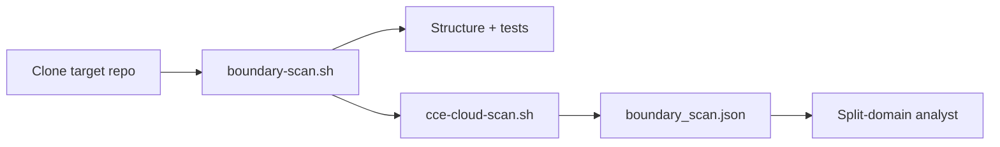

# What CCE adds to the monorepo services splitter

This module’s **clone-and-boundary-scan** stage already produced structural facts: languages, coarse modules, shared libs, API surfaces, CI workflows, and a **test inventory**. **CCE** (Code Context Engine, [`appcd-dev/cce`](https://github.com/appcd-dev/cce)) adds a different lens: **which cloud provider APIs the application code actually calls**, mapped to structured entitlements.

CCE runs automatically inside `boundary-scan.sh` (via `scripts/cce-cloud-scan.sh`) and lands in `boundary_scan.json` under **`cloud_entitlements`**.

---

## Powers you gain (vs scan-only)

| Power | What it means for split analysis |
|-------|----------------------------------|
| **Unknown-repo cloud surface** | Before reading README or guessing, see whether the repo talks to AWS, GCP, Azure, etc., and *which* services (S3, Bedrock, Storage, …). |
| **Method-level evidence** | Each entitlement includes `file`, `line`, `method` (fully qualified SDK call), and `operation` — citeable in split plans and PRs. |
| **Per-language passes** | CCE runs once per detected language (`go` → GO, `java` → JAVA, `typescript` → JAVASCRIPT). Polyglot monorepos get separate signal per stack. |
| **IAM / PoLP hints** | `summary.by_provider` and `entitlements[]` support “this proposed service only needs these API actions” — complements test inventory for **risk** (untested + cloud-heavy packages). |
| **Analyst grounding** | Split-domain analyst can reason about **deploy boundaries + cloud blast radius**, not only import graphs and test counts. |
| **Notes mirror** | `cloud_entitlements_scan_status` and `cloud_entitlements_total` are written to `notes.json` for quick HalGuard / orchestration checks. |

CCE does **not** replace boundary scan. It **augments** it:

```
boundary_scan.json
├── languages, modules, shared_libraries, api_surfaces, ci_deploy_units  ← structure
├── test_inventory, test_confidence_score, packages_without_tests       ← test risk
└── cloud_entitlements                                                  ← cloud API usage (CCE)
```

---

## What `cloud_entitlements` contains

Typical shape after a successful scan:

```json
{
  "scan_status": "ok",
  "cce_version": "0.0.4",
  "files_scanned": 120,
  "entitlements_total": 42,
  "entitlements_truncated": false,
  "summary": {
    "total_entitlements": 42,
    "by_provider": { "AWS": 30, "GCP": 12 }
  },
  "entitlements": [
    {
      "provider": "AWS",
      "resource": "bedrock",
      "operation": "NewFromConfig",
      "file": "internal/service/model_sync_bedrock.go",
      "line": 82,
      "method": "github.com/aws/aws-sdk-go-v2/service/bedrock.NewFromConfig"
    }
  ]
}
```

| Field | Use |
|-------|-----|
| `scan_status` | `ok` \| `failed` \| `skipped` — whether to trust the block |
| `summary.by_provider` | Executive view: “this monorepo is AWS-heavy” |
| `entitlements[]` | Drill-down for service boundaries, IAM tables, migration phases |
| `entitlements_truncated` | If true, list was capped (default 500); treat as lower bound |

---

## Where it runs in the workflow



1. **Ubuntu sidecar** — `install_tools` includes `cce` (or script self-installs from StackGen releases).
2. **Scan stage** — after clone, same `WORK_ROOT` as boundary scan.
3. **Downstream** — analyst reads `boundary_scan_json_path`; inspect `cloud_entitlements` for cloud coupling and split risk.

---

## What CCE does *not* do here

- **No live cloud calls** — static analysis only; no credentials, no account inventory.
- **No IaC** — does not read Terraform/Kubernetes YAML for IAM roles (code paths only).
- **No wrapper magic by default** — thin wrappers around boto3/SDKs may need a [custom mapper lens](https://github.com/appcd-dev/cce/blob/main/docs/custom_definition.md) (`-mapper-file`); built-in `-filter cloud` targets direct SDK usage.
- **Not a split decision engine** — humans/agents still choose bounded contexts; CCE supplies **facts**.
- **Very large repos** — full-tree scans can be slow or hit CCE limits; entitlement list may be truncated.

Skip CCE for a run: `MONOREPO_SPLIT_SKIP_CCE=1` on the sidecar.

---

## Practical prompts for readers

When reviewing `boundary_scan.json` for an unknown repo, ask:

1. **Which providers?** → `cloud_entitlements.summary.by_provider`
2. **Which services share a cloud client?** → group `entitlements` by `resource` + directory prefix
3. **Does a proposed cut cross cloud SDK usage?** → compare `file` paths to candidate module boundaries
4. **Is cloud usage in untested code?** → intersect `entitlements[].file` with `packages_without_tests`

---

## Install reference (operators)

| Environment | How `cce` arrives |
|-------------|-------------------|
| Guild Ubuntu sidecar | `INSTALL_TOOLS=…,cce` via this module’s `install_tools` |
| Script fallback | `cce-cloud-scan.sh` downloads `releases.stackgen.com/binaries/cce/v0.0.4/…` |
| Developer laptop | `brew tap stackgenhq/stackgen && brew install cce` |
| Container | `docker pull ghcr.io/appcd-dev/cce:<tag>` |

Script pack version **20260602.11+** embeds `cce-cloud-scan.sh` in the tarball baked at `tofu apply`.

---

## Related

- Module README — sidecar env drift, script pack versioning
- [`templates/monorepo-clone-and-scan.md.tftpl`](../templates/monorepo-clone-and-scan.md.tftpl) — runner success criteria
- CCE project — [`README`](https://github.com/appcd-dev/cce), use cases under `docs/usages/`
