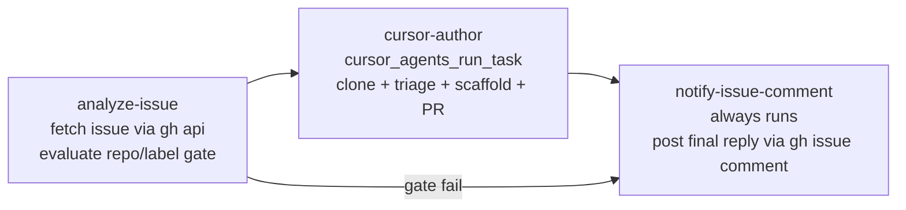

# aios-agent-scenario-author

Closes the **solutions-engineer (SE) feedback loop** for this repository. When
an SE files a `scenario-request` issue against the configured GitHub repo
(default `appcd-dev/solutions`), the agent:

1. Parses the trigger payload, fetches the issue body via `gh api`, and
   evaluates the repo + label gate.
2. Hands the entire clone + triage + scaffold + PR job to a **Cursor Cloud
   Agent** via `cursor_agents_run_task`. Cursor:
   - Clones the repo into its own ephemeral sandbox (using its built-in
     GitHub App, `OpenAsCursorGithubApp = true`).
   - Scans `examples/scenarios/*` and `docs/se-playbook.md` for an existing
     scenario that already fits the prospect's question.
   - Either:
     - **Match found** → emits `Verdict: match` in its conversation
       summary; the planner posts a "use scenario X" comment on the
       originating issue.
     - **No match** → scaffolds
       `examples/scenarios/<slug>/{main.tf,variables.tf,outputs.tf,terraform.tfvars.example,README.md}`,
       registers it in `scripts/demo.sh`, appends a row to
       `docs/se-playbook.md`, runs `tofu fmt -recursive` + `tofu init
       -backend=false` + `tofu validate`, and lets its GitHub App
       auto-create the PR (`target.autoCreatePr = true`). Reports back via
       `Verdict: pr` (validate clean) or `Verdict: draft_pr` (validate
       failed → PR opened as draft).
3. Posts a single `gh issue comment` on the originating issue with the
   PR URL, the existing-match pointer, or the bounded blocker explanation.

The Cursor delegation **replaces the legacy Ubuntu CLI shell-scripting flow**
(`git clone` + `tofu fmt` + sed-splice + `gh pr create`), which was the
single biggest source of run-to-run flakiness in this module.

## Why this is the "power move"

| Without this module                                                       | With this module                                                       |
| ------------------------------------------------------------------------- | ---------------------------------------------------------------------- |
| SE files an issue, waits days, hopes engineering sees it.                 | SE files an issue, gets a triaged reply (existing match or PR) within minutes. |
| Scenario PRs require an engineer to scaffold five files and a `demo.sh` entry. | Cursor scaffolds, validates, and opens the PR — humans only review. |
| Brittle Ubuntu-CLI scripts: every `sed` splice, every `git push`, every `gh pr create` is a separate failure mode. | Cursor's IDE-quality file editing + auto-PR via its GitHub App removes ~80% of the failure surface. |
| Feedback loop documented in `docs/se-feedback.md` but unowned.            | Bot is the owner; humans close the loop via PR review.                 |

## Layer

This is a **Layer 2** agent module per `AGENTS.md`. It is **self-contained**:
it owns both the GitHub and Cursor Guild integrations it needs internally
via nested `aios-integration-*` blocks. Dependencies:

- `aios-foundation` (model registry).
- `aios-policies` (the `dangerous_ops` policy id).
- `aios-integration-github` (instantiated INSIDE this module under the name
  `scenario-author-github[-<name_suffix>]`, bound to the tenant
  `github_secret_id`).
- `aios-integration-cursor` (instantiated INSIDE this module under the name
  `scenario-author-cursor[-<name_suffix>]`, fed `cursor_api_key`).

Tenants that want to SHARE a pre-existing `github-integration` /
`cursor-tool` container across multiple agent modules can pass
`existing_github_integration_name` / `existing_cursor_integration_name`
to skip the internal provisioning and attach to the existing container —
typical when wiring this alongside `aios-agent-software-engineering`,
which also consumes a Cursor MCP.

It does **not** depend on `aios-agent-terraform-bot` or
`aios-agent-software-engineering`. The three agents own disjoint SOP
namespaces (`scenario-author-*` vs `terraform-bot-*` vs `cursor-developer-*`)
and can co-exist in the same tenant against the same GitHub org — the
label gate (default `scenario-request`) keeps this bot in its lane.

## Usage

### Self-contained (one tenant secret + one Cursor key)

```hcl
# 1. Tenant-level GitHub PAT secret (re-use across modules).
resource "sg_secret" "github_pat" {
  name        = "github-pat"
  description = "GitHub PAT (repo + read:org) for AIOS agents"
  category    = "SCM"
  subcategory = "github"
  metadata    = { provider = "github", token = var.github_token }
}

# 2. The agent module — provisions its own scenario-author-github +
#    scenario-author-cursor Guild integrations internally.
module "scenario_author" {
  source = "github.com/appcd-dev/solutions//modules/aios-agent-scenario-author?ref=main"

  model_names      = module.foundation.model_names
  policy_ids       = { dangerous_ops = module.policies.policy_ids.dangerous_ops }
  github_secret_id = sg_secret.github_pat.id
  cursor_api_key   = var.cursor_api_key

  # Optional — defaults to the public solutions repo.
  repository_full_name   = "appcd-dev/solutions"
  scenario_request_label = "scenario-request"

  # Optional — defaults to $10/day on the planner side. Cursor compute is
  # metered separately against `cursor_api_key`.
  agent_budget = 10

  # Optional — set false if you want to register the workflow without
  # wiring a webhook (Guild "Run workflow" UI only).
  enable_webhook = true
}
```

### Sharing integrations across modules

When the tenant already runs a shared `cursor-tool` (e.g. for
`aios-agent-software-engineering`) and a shared `github-integration`,
opt out of internal provisioning with the overrides:

```hcl
module "scenario_author" {
  # ... same inputs as above, MINUS cursor_api_key ...

  existing_github_integration_name = module.github_integration.integration_name
  existing_cursor_integration_name = module.cursor_integration.integration_name
}
```

`cursor_api_key` and `existing_cursor_integration_name` are
**mutually exclusive** — set exactly one. The plan-time precondition in
`main.tf` enforces this.

After `tofu apply`, wire the webhook in GitHub:

1. `module.scenario_author.webhook_id` and `webhook_token` are emitted.
2. In the target repo, add a webhook:
   - **Payload URL**: copy from your Guild instance (the `sg_webhook`
     resource details endpoint — see Guild docs).
   - **Content type**: `application/json`.
   - **Secret**: paste `module.scenario_author.webhook_token` (sensitive
     output).
   - **Events**: select **Issues** (`issues.opened` + `issues.labeled`
     both map to StackGen's normalized `issue.created` trigger).
3. File a `scenario-request` issue and watch the bot reply on the issue
   within a few minutes (Cursor's cloud agent typically takes 5-10 min on
   a non-trivial scaffold).

## Variables

| Name                                | Type                                                | Default                                          | Notes                                                                                                                                                       |
| ----------------------------------- | --------------------------------------------------- | ------------------------------------------------ | ----------------------------------------------------------------------------------------------------------------------------------------------------------- |
| `model_names`                       | `list(string)`                                      | _required_                                       | Same shape every other agent module takes — pass `module.foundation.model_names`.                                                                            |
| `policy_ids`                        | `object({ dangerous_ops = string })`                | _required_                                       | Only the `dangerous_ops` key is consumed.                                                                                                                    |
| `github_secret_id`                  | `string`                                            | _required_                                       | ID of a pre-existing `sg_secret` holding the GitHub PAT. Bound to the internal GitHub integration so `gh api` and `gh issue comment` authenticate.           |
| `cursor_api_key`                    | `string` (sensitive)                                | `""`                                             | Cursor Cloud Agents API key. Required when not supplying `existing_cursor_integration_name`. Mutually exclusive with `existing_cursor_integration_name`.    |
| `existing_github_integration_name`  | `string`                                            | `""`                                             | When set, skip internal GitHub integration provisioning and attach to the supplied existing name (sharing model).                                            |
| `existing_cursor_integration_name`  | `string`                                            | `""`                                             | When set, skip internal Cursor integration provisioning and attach to the supplied existing name (sharing model). Mutually exclusive with `cursor_api_key`. |
| `repository_full_name`              | `string`                                            | `appcd-dev/solutions`                            | Hard repo gate. Any other repo's webhook events get a "wrong repo" comment. **Gotcha**: if the GitHub repo is renamed, re-apply with the new name.            |
| `scenario_request_label`            | `string`                                            | `scenario-request`                               | Hard label gate. Issues without this label get a "missing label" comment.                                                                                    |
| `agent_budget`                      | `number`                                            | `10`                                             | Daily USD spend cap for the planner side. Cursor compute is metered separately by Cursor against `cursor_api_key`.                                            |
| `enable_webhook`                    | `bool`                                              | `true`                                           | Disable for staging tenants or dry-runs; agent + workflow still register.                                                                                    |
| `name_suffix`                       | `string`                                            | `""`                                             | Kebab-case suffix appended to every named Guild resource (agent, 3 SOPs, workflow, webhook, AND the two internal integrations).                              |
| `trigger_event_types`               | `list(string)`                                      | `["issue.created","issues.opened","issues.labeled"]` | StackGen normalized event types that fire the workflow.                                                                                                      |
| `workflow_skill_refs`               | `map(list(string))`                                 | `{}`                                             | Optional `skill_refs` appended per stage. Keys are `scenario-request-triage::<stage_id>`.                                                                    |

## Outputs

| Name                       | Sensitive | Notes                                                                                                  |
| -------------------------- | --------- | ------------------------------------------------------------------------------------------------------ |
| `agent_names`              | no        | Map. `scenario_author` → the Guild agent name.                                                          |
| `workflow_name`            | no        | The `scenario-author-request-triage` workflow. Wire to `aios-agent-schedules` if needed.                |
| `runbook_sop_names`        | no        | The three SOP names this module owns (`orchestration`, `cursor_author`, `pr_and_notify`). The map shape changed in the Cursor refactor — the old `triage` + `scaffold` keys collapsed into `cursor_author`. |
| `github_integration_name`  | no        | Final Guild integration name (`scenario-author-github[-<suffix>]` or the consumer override).            |
| `cursor_integration_name`  | no        | Final Guild integration name (`scenario-author-cursor[-<suffix>]` or the consumer override).            |
| `webhook_id`               | no        | Empty when `enable_webhook = false`.                                                                    |
| `webhook_token`            | yes       | The secret to paste in GitHub's webhook configuration.                                                  |

## Workflow stages

`scenario-request-triage` has **three** stages (collapsed from the legacy
four — the old `triage` + `scaffold-validate-pr` stages merged into a
single Cursor delegation stage):



The `notify-issue-comment` stage **always runs** — it's the user-visible
output. It branches on `cursor_verdict` (returned by Cursor's conversation
summary in a structured `## Verdict` block) to post one of:

| Path                                | Comment kind                          |
| ----------------------------------- | -------------------------------------- |
| Repo or label gate failed           | "wrong repo" / "missing label" (posted in `analyze-issue`)            |
| `cursor_verdict == "match"`         | "Existing scenario match" with run command + README link              |
| `cursor_verdict == "pr"`            | "Scaffolded a PR" with PR URL + validation summary                    |
| `cursor_verdict == "draft_pr"`      | "Draft PR (validation failed)" with `cc @<contributors-se-owner>`     |
| `cursor_verdict == "blocked"`       | "Workflow blocked" quoting Cursor's `Reason:` line                    |
| Budget exhausted upstream           | "Budget exhausted" with retry guidance + the day's spend              |

## Hard rules (from the orchestration SOP)

- **Three-path mutation surface**: Cursor only writes to
  `examples/scenarios/<slug>/`, `scripts/demo.sh`, and `docs/se-playbook.md`.
  The cursor-author SOP encodes this as Cursor's "Forbidden surface" section
  with a `git status --porcelain` self-check before commit.
- **Signature-driven module emission**: every `module "..."` block in the
  scaffold is built from the per-module signature index Cursor extracts
  from `modules/<m>/variables.tf` (policy_ids keys, integration_name shape,
  extra required vars). Cursor never guesses shapes.
- **Single Cursor task per issue**: `cursor_agents_run_task` is the only
  approved entry point in the happy path. NEVER chain multiple `run_task`
  calls or fan out to `cursor_agents_launch` + `cursor_agents_add_followup`
  loops — Cursor's internal retry handles iteration.
- **No org-wide enumeration**: the trigger payload is the only source of
  truth for `repository_full_name`.
- **No `tofu plan` / `apply` / `destroy`**: validation inside Cursor's
  sandbox is `fmt + init -backend=false + validate` only. Real apply
  happens later via `make demo SCENARIO=<slug>`.
- **Split GitHub auth path**: the GitHub Guild integration uses the tenant
  PAT (for `gh api` and `gh issue comment`); the Cursor cloud agent uses
  Cursor's own GitHub App (for clone, branch, push, PR). The PAT is
  intentionally NOT pasted into the Cursor prompt.
- **Persona ≤ 15000 bytes**: enforced by `_persona_guard.tf` (plan-time
  precondition).

## Failure handling

See `docs/se-feedback.md` for the manual recovery path. Common cases:

| Symptom                                                  | Recovery                                                                                                                |
| -------------------------------------------------------- | ----------------------------------------------------------------------------------------------------------------------- |
| Bot replies "wrong repo"                                 | Confirm the webhook is wired to `var.repository_full_name`. If the repo was renamed in GitHub, update the var + re-apply. |
| Bot replies "missing label"                              | Add the `scenario-request` label, or re-file via the issue template (which sets the label automatically).                |
| Bot replies "Existing scenario match"                    | Working as intended — run `make demo SCENARIO=<name>` per the comment.                                                  |
| Bot opens a draft PR with `validation failed`            | A scenario owner from `CONTRIBUTORS-SE.md` reviews + fixes the scaffold + un-drafts. The PR body lists what to fix.       |
| Bot replies "Budget exhausted"                           | Wait for the daily reset, or raise `agent_budget` on the planner side. (If Cursor's own quota is exhausted, the cursor task itself returns FAILED — surfaced as a "Workflow blocked" comment instead.) |
| Bot reports "blocked: gh auth failed"                    | Re-authenticate `aios-integration-github`; the bot retries on the next issue event.                                      |
| Bot reports "blocked: cursor agent failed"               | Inspect the Cursor cloud agent run via `cursor_agents_get_conversation` against the agent ID logged in the planner notes. Common causes: invalid `cursor_api_key`, Cursor's GitHub App not installed on the target repo, or a Cursor sandbox image regression. |
| Bot replies "Triaged, no action taken"                   | Transient mid-task yield. Close + re-open the issue. If it happens twice, ping engineering.                              |
| Bot does nothing for > 10 minutes                        | Check Guild → workflow runs for `scenario-request-triage`. Most common cause: webhook not wired, or Cursor's `run_task` is still polling (the cloud agent itself can take 5-10 min on non-trivial scaffolds — wait one more poll cycle before assuming a hang). |

## See also

- `docs/se-playbook.md` — prospect-question → scenario map the bot
  searches against.
- `docs/se-feedback.md` — the SE feedback loop this bot automates.
- `CONTRIBUTORS-SE.md` — scenario owners who review the bot's PRs.
- `modules/aios-integration-cursor/` — the Cursor Cloud Agents MCP wrapper this module attaches to.
- `modules/aios-agent-software-engineering/` — sibling agent that also uses Cursor (for general feature work via Linear tickets); the two share a `cursor-tool` integration if you set `existing_cursor_integration_name`.
- `modules/aios-agent-terraform-bot/` — sibling agent for module-change triage on production module repos.
