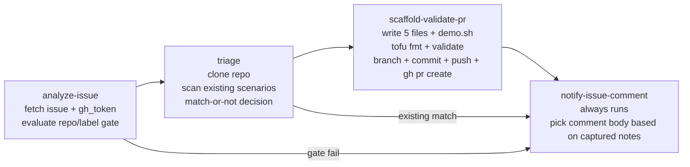

# aios-agent-scenario-author

Closes the **solutions-engineer (SE) feedback loop** for this repository. When
an SE files a `scenario-request` issue against the configured GitHub repo
(default `appcd-dev/aios-modules`), the agent:

1. Parses the structured issue body (the
   `.github/ISSUE_TEMPLATE/scenario-request.md` template).
2. Searches `examples/scenarios/*` and `docs/se-playbook.md` for an existing
   demo that already fits the prospect's question.
3. Either:
   - **Match found** → comments back on the issue with a pointer to the
     existing scenario plus the exact `make demo SCENARIO=<name>` command,
     or
   - **No match** → scaffolds a brand-new
     `examples/scenarios/<slug>/{main.tf,variables.tf,outputs.tf,terraform.tfvars.example,README.md}`,
     registers it in `scripts/demo.sh`, runs `tofu fmt -recursive` +
     `tofu validate`, opens a PR linking the originating issue, and
     comments back with the PR URL.

All work happens in a Guild Ubuntu CLI sandbox using the `gh` CLI (installed
on first use). The orchestration SOP enforces a strict **repo + label gate**
(§0c) so the bot never reacts to unrelated org-wide issue noise.

## Why this is the "power move"

| Without this module                                                       | With this module                                                       |
| ------------------------------------------------------------------------- | ---------------------------------------------------------------------- |
| SE files an issue, waits days, hopes engineering sees it.                 | SE files an issue, gets a triaged reply (existing match or draft PR) within minutes. |
| Scenario PRs require an engineer to scaffold five files and a `demo.sh` entry.            | The bot scaffolds, validates, and opens the PR — humans only review.   |
| Feedback loop documented in `docs/se-feedback.md` but unowned.            | Bot is the owner; humans close the loop via PR review.                 |

## Layer

This is a **Layer 2** agent module per `AGENTS.md`. It depends on:

- `aios-foundation` (model registry).
- `aios-policies` (the `dangerous_ops` policy id).
- `aios-integration-github` (the GitHub Guild integration — must be
  authenticated against the repo named in `repository_full_name`).
- `aios-integration-ubuntu` (the Ubuntu CLI sandbox the bot uses for git,
  `gh`, and `tofu`).

It does **not** depend on `aios-agent-terraform-bot`. The two agents own
disjoint SOP namespaces (`scenario-author-*` vs `terraform-bot-*`) and can
co-exist in the same tenant against the same GitHub org — the label gate
(default `scenario-request`) keeps this bot in its lane.

## Usage

```hcl
module "scenario_author" {
  source = "github.com/appcd-dev/aios-modules//modules/aios-agent-scenario-author?ref=main"

  model_names = module.foundation.model_names
  policy_ids  = { dangerous_ops = module.policies.policy_ids.dangerous_ops }

  integration_names = {
    github     = module.github_integration.integration_name
    ubuntu_cli = module.ubuntu_integration.integration_name
  }

  # Optional — defaults to the public modules repo.
  repository_full_name   = "appcd-dev/aios-modules"
  scenario_request_label = "scenario-request"

  # Optional — defaults to $10/day, enough for ~3-5 happy-path runs.
  agent_budget = 10

  # Optional — set false if you want to register the workflow without
  # wiring a webhook (Guild "Run workflow" UI only).
  enable_webhook = true
}
```

After `tofu apply`, wire the webhook in GitHub:

1. `module.scenario_author.webhook_id` and `webhook_token` are emitted.
2. In the target repo, add a webhook:
   - **Payload URL**: copy from your Guild instance (the `sg_webhook`
     resource details endpoint — see Guild docs).
   - **Content type**: `application/json`.
   - **Secret**: paste `module.scenario_author.webhook_token` (sensitive
     output).
   - **Events**: select **Issues** (`issues.opened` + `issues.labeled`
     both map to StackGen's normalized `issue.created` trigger).
3. File a `scenario-request` issue and watch the bot reply on the issue
   within a minute or two.

## Variables

| Name                     | Type                                                | Default                                          | Notes                                                                                                                                                       |
| ------------------------ | --------------------------------------------------- | ------------------------------------------------ | ----------------------------------------------------------------------------------------------------------------------------------------------------------- |
| `model_names`            | `list(string)`                                      | _required_                                       | Same shape every other agent module takes — pass `module.foundation.model_names`.                                                                            |
| `policy_ids`             | `object({ dangerous_ops = string })`                | _required_                                       | Only the `dangerous_ops` key is consumed; pass other keys if convenient (they will be ignored).                                                              |
| `integration_names`      | `object({ github, ubuntu_cli })`                    | _required_                                       | Both must be non-empty. GitHub is for `gh api`/`gh auth token`; Ubuntu CLI is for `gh repo clone`, `gh pr create`, `git`, `tofu`, etc.                       |
| `repository_full_name`   | `string`                                            | `appcd-dev/aios-modules`                         | Hard repo gate. Any other repo's webhook events get a "wrong repo" comment. **Gotcha**: if the GitHub repo is renamed, re-apply with the new name.            |
| `scenario_request_label` | `string`                                            | `scenario-request`                               | Hard label gate. Issues without this label get a "missing label" comment.                                                                                    |
| `agent_budget`           | `number`                                            | `10`                                             | Daily USD spend cap. Happy-path runs cost ~$2-$4 so $10/day buys 2-3 runs. Raise if multiple SEs file in a single day. Budget-exhausted runs comment back.    |
| `enable_webhook`         | `bool`                                              | `true`                                           | Disable for staging tenants or dry-runs; agent + workflow still register, you just invoke from Guild "Run workflow" UI.                                       |
| `name_suffix`            | `string`                                            | `""`                                             | Kebab-case suffix appended to every named Guild resource this module creates (agent, 4 SOPs, workflow, webhook). Use when the same tenant hosts multiple bots. |
| `trigger_event_types`    | `list(string)`                                      | `["issue.created","issues.opened","issues.labeled"]` | StackGen normalized event types that fire the workflow. Default is a superset to cover unknown Guild webhook dialects; tighten once you've observed live runs. |
| `workflow_skill_refs`    | `map(list(string))`                                 | `{}`                                             | Optional `skill_refs` appended per stage. Keys are `scenario-request-triage::<stage_id>`. See `variables.tf`.                                                |

## Outputs

| Name                | Sensitive | Notes                                                                              |
| ------------------- | --------- | ---------------------------------------------------------------------------------- |
| `agent_names`       | no        | Map. `scenario_author` → the Guild agent name.                                      |
| `workflow_name`     | no        | The `scenario-request-triage` workflow. Wire to `aios-agent-schedules` if needed.   |
| `runbook_sop_names` | no        | The four SOP names this module owns. Useful when composing with other agents.       |
| `webhook_id`        | no        | Empty when `enable_webhook = false`.                                                |
| `webhook_token`     | yes       | The secret to paste in GitHub's webhook configuration.                              |

## Workflow stages

`scenario-request-triage` has four stages, mapped 1:1 to named subagent phases
in `scenario-author-orchestration-sop`:



The `notify-issue-comment` stage **always runs** — it's the user-visible
output. It branches on captured notes to post one of:

| Path                                | Comment kind                          |
| ----------------------------------- | -------------------------------------- |
| Repo or label gate failed           | "wrong repo" / "missing label" (posted in `analyze-issue`)             |
| Existing match found                | "Existing scenario match" with run command + README link              |
| Happy path PR opened                | "Scaffolded a PR" with PR URL + validation summary                    |
| Validation failed, draft PR opened  | "Draft PR (validation failed)" with `cc @<contributors-se-owner>`     |
| Upstream stage blocked              | "Workflow blocked" quoting the blocker text                            |

## Hard rules (from the orchestration SOP)

- **Three-path mutation surface**: the bot only writes to
  `examples/scenarios/<slug>/`, `scripts/demo.sh`, and `docs/se-playbook.md`.
  Anything outside that surface gets `git reset` before commit.
- **Signature-driven module emission**: every `module "..."` block is built
  from the per-module signature index the triage stage extracts from
  `modules/<m>/variables.tf` (policy_ids keys, integration_name shape,
  extra required vars). The bot never guesses shapes.
- **Single PR per issue**: subagents check `pr_url` before re-creating.
- **No org-wide enumeration**: the trigger payload is the only source of
  truth for `repository_full_name`.
- **No `tofu plan` / `apply` / `destroy`**: validation is
  `fmt + init -backend=false + validate` only. Real apply happens later via
  `make demo SCENARIO=<slug>`.
- **Bootstrap on first use**: `gh`, `git`, and `tofu` are installed by the
  bot if the Ubuntu sandbox doesn't ship them. Apt + tarball fallbacks both
  attempted; on failure the bot posts a "bootstrap failed" comment.
- **Persona ≤ 15000 bytes**: enforced by `_persona_guard.tf` (plan-time
  precondition).

## Failure handling

See `docs/se-feedback.md` for the manual recovery path. Common cases:

| Symptom                                                  | Recovery                                                                                                                |
| -------------------------------------------------------- | ----------------------------------------------------------------------------------------------------------------------- |
| Bot replies "wrong repo"                                 | Confirm the webhook is wired to `var.repository_full_name`. If the repo was renamed in GitHub, update the var + re-apply. |
| Bot replies "missing label"                              | Add the `scenario-request` label, or re-file via the issue template (which sets the label automatically).                |
| Bot replies "Existing scenario match"                    | Working as intended — run `make demo SCENARIO=<name>` per the comment.                                                  |
| Bot opens a draft PR with `validation failed`            | A scenario owner from `CONTRIBUTORS-SE.md` reviews + fixes the scaffold + un-drafts. The PR body lists what to fix.       |
| Bot replies "Budget exhausted"                           | Wait for the daily reset, or raise `agent_budget`. Runs that hit the cap always comment back — no silent failures.        |
| Bot reports "blocked: no GitHub token"                   | Re-authenticate `aios-integration-github`; the bot retries on the next issue event.                                      |
| Bot reports "bootstrap failed"                           | Sandbox is missing `gh` / `git` / `tofu` AND can't install them (no sudo / no network). Use a richer Ubuntu image.        |
| Bot reports "Workflow blocked: unknown modules"          | Issue body referenced modules that don't exist under `modules/`. Either add the modules or correct the issue body.        |
| Bot opens a PR with `demo.sh splice corrupted` checklist | The bot's splice attempts hit a bad anchor. Manually append the case clause; the PR's reviewer checklist explains.        |
| Bot replies "Triaged, no action taken"                   | Transient mid-stage yield. Close + re-open the issue. If it happens twice, ping engineering.                              |
| Bot does nothing for > 5 minutes                         | Check Guild → workflow runs for `scenario-request-triage`. Most common cause: webhook not wired, or `trigger_event_types` mismatch with the Guild release's normalized vocabulary. Inspect a workflow run's input payload to see the actual `event_type` value and adjust `var.trigger_event_types`. |

## See also

- `docs/se-playbook.md` — prospect-question → scenario map the bot
  searches against.
- `docs/se-feedback.md` — the SE feedback loop this bot automates.
- `CONTRIBUTORS-SE.md` — scenario owners who review the bot's PRs.
- `modules/aios-agent-terraform-bot/` — sibling agent for module-change
  triage on production module repos.
